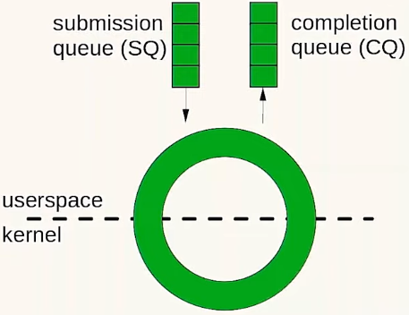

[Asynchronous I/O and Coroutines for Smooth Data Streaming - Björn Fahller - ACCU 2022](https://www.youtube.com/watch?v=54oGgmMAUNk)

终于有一个讲解异步 I/O 和协程的了……

本文前提假设你已经对 io_uring 和 C++20 协程有一定了解。

## 前言

最近 linux 引入了 io_uring，原生支持异步 IO，并且系统调用次数很少。

在原来的 linux 上，基本就是做 select/poll/epoll

```cpp
class poller {
public:
    using worker = std::function<void(std::span<char> data)>;
    void add(int fd, worker w) {
        fds_.push_back({fd, POLLIN, 0});
        cbs_.emplace(fd, std::move(w));
    }
    void wait() {
        auto r = poll(fds_.data(), fds_.size(), -1);
        for (auto& e : fds_) {
            if (e.revents & POLLIN) {
                // sildes 里就不用什么复杂的 buffer 了
                // 1500 是以太网最大那个分片
                char buffer[1500];
                auto len = ::read(e.fd, buffer, sizeof(buffer));
                cbs_[e.fd](std::span(buffer).first(len));
            }
        }
    }
private:
    std::vector<pollfd> fds_;
    std::map<int, worker> cbs_;
};
```

## 使用 poll/read 的同步 I/O 

传统的 I/O 看起来就像是：


可以使用配合 strace，linux 比较不错的 debug 工具，运行程序，然后例如对于 udp 可以使用

```shell
echo aa > /dev/udp/<host>/<port>
```

形如这种的端口号，linux 特有，可以直接模拟出端口了

## io_uring

### 使用示例

io_uring 使用共享内存并且 lock free。



```cpp
#include <liburing.h>

io_uring uring;
io_uring_queue_init(8, &uring, 0);	

...

auto entry = io_uring_get_sqe(&uring);
io_uring_prep_read(entry, fd, ptr, size, 0);
io_uring_sqe_set_data(entry, work);

...
    
io_uring_cqe* entry;
auto e = io_uring_wait_cqe(&uring, &entry);
```

你也许会写一个类似于这样的代码：

```cpp
#include <liburing.h>
class ring {
public:
    using work = std::function<bool(std::span<char>)>;
    ring();
    ring& operator=(ring&&) = delete;
    ~ring();
    void add(int fd, work);
    void wait();
private:
    struct read_work;
    std::list<read_work> pending_;
    io_uring uring_;
};

struct ring::read_work {
	work cb_;
    int fd_;
    // 在 prep 阶段就需要知道使用的 buffer
    std::array<char, 1500> buffer_;
};

void ring::add(int fd, work w) {
    auto& work = pending_.emplace_back();
    work.cb_ = std::move(w);
    work.fd_ = fd;
    auto entry = io_uring_get_sqe(&uring_);
    // no system call in io_uring_prep_read, 单纯访问一下 array
    io_uring_prep_read(entry, fd, work.buffer_.data(), work.buffer_.size(), 0);
    io_uring_sqe_set_data(entry, &work);
}
```

之后就可以真正异步进行了，内核帮我们填充数据，我们自己的进程则处理数据，中间是 zero-copy

可以灵活配合 strace -c 查看 syscall 次数，配合 nping 以及前文提到的方法进行测试。

## 协程

协程最大的作用就是，让你像编写连续的代码一样编写异步代码。

其他介绍参考本博客协程文章，以及源码 

## io_uring + 协程

- io_uring 提供了异步数据
- 调用协程 promise 的 yiled_value() 来从协程中输出值
- 使用 co_await 从 upstream 协程中读取值
- 使用 co_yield 来向下转发值

