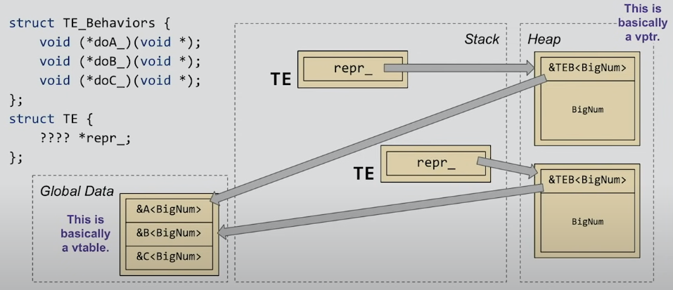

[Back to Basics: Type Erasure - Arthur O'Dwyer - CppCon 2019](https://www.youtube.com/watch?v=tbUCHifyT24)

又是 Arthur O'Dwyer，这期演讲是 back to basics，类型擦除的具体细节。

## 简介

你可能从 C# 或者 Java 中听说过 type erasure，但其他语言的类型擦除和 C++ 的完全不是一回事。

我们讨论的最初问题是：如何写一个函数，可以接受 lambda 作为参数

普通的做法可能是：

```cpp
class Shelf {
    template<typename Func>
    void for_each_book(Func f) {
        for (const Book& b : books_) f(b);
    }
};

Shelf myshelf;
myshelf.for_each_book([](auto&& book) { book.print(); });
// 这要求每个翻译单元中都有这个成员函数模板，我们可以将其改为回调形式

class Shelf {
    void for_each_book(CallBack f) {
        for (const Book& b : books_) f(b);
    }
};

// CallBack 可能只是 std::funtion<void(const Book&)>
// 现在就可以分文件了
```

## 类型擦除 concretifies 模板

模板并不是一个函数，但 type erasure 后的函数是一个真正的函数，可以被编译。

举个例子，std::sort

std::sort 是一个函数模板

- 可以接受任何 Copmarator
- 内联
- **必须** 定义为头文件：编译慢，代码膨胀

作为对比，C-style 的 qsort 接收函数指针

- 只能接受固定的 Comparator
- **不能**被内联
- **可以** 被定义在外部
- 并不是类型安全的

我们可以同时拥有二者的优点吗？

## Callable 可以被这样切分

类似于 C 中的 qsort_r

```c
void qsort_r(void *base, size_t nmemb, size_t size,
           int (*compar)(const void *, const void *, void *),
           void *cookie);
```

其函数签名长这样，comparator 中可以多一个参数，通过最后那个 void* arg 传入。

我们这样想，

**不要**把compar当做需要你支持 cookie 的行为，**而是**将他看成 cookie 本身提供的行为

qsort_r 能做什么？传一个 compar 仅此而已。cookie 只提供了一个行为

给出一个可调用对象

```cpp
template<typnemae Callable>
void foo(Callable& func);
```

可以将其分为 *它的表示* 以及 *它的行为*

它的表示，也就是实际内存中的 bit，只是一个函数指针和地址

假设 foo 的参数 `func` 的要求是 不接受参数，return int

那么我们可以将其分开为：

```cpp
void* representation = &callable;
int (*behavior_when_called)(void*) = +[](void* r) {
    return (*(Callable *)r)();		// 将 r 转换为 Callable 的类型之后调用
}
assert(behavior_when_called(representation) == func());
```

这样当我们调用 `behavior_when_called(representation)` 的效果和调用 `func()` 一样。

> plus lambda，众所周知 lambda 是类类型，这里需要一个函数指针，所以一元+ （正符号）可以将 lambda 转换为算术类型。

我们开头的 类型`Callable`，如果我们不知道它的具体类型就无法使用。

当我们将其分为其表示和行为时，我们擦除了他的所有关于类型的信息（size, alignment, copyability...）

考虑一个可以取反的对象，也可以使用这种方法：

```cpp
template<typename Negatable>
void foo(Negatable& number)
```

假设 number 支持按位取反且返回 int，我们可以将其分开：

```cpp
void* representation = &number;
int (*behavior_when_negated)(void*) = +[](void* r) {
    return ~(*(Negatable*)r);
};
assert(behavior_when_negated(representation) == ~number);
```

嗯，number 也许还支持取非，

```cpp
void* representation = &number;
int (*behavior_when_negated)(void*) = +[](void* r) {
    return ~(*(Negatable*)r);
};
int (*behavior_when_notted)(void*) = +[](void* r) {
    return !(*(Negatable*)r);
};
assert(behavior_when_negated(representation) == ~number);
assert(behavior_when_notted(representation) == !number);
```

## 将表示和行为包装

C 中没有类，所以 qsort_r 中的 cookie 只能有一种 comparsion 行为，C++我们可以做的更好。

```cpp
struct TypeErasedNumberRef {
	void* representation_;
    int (*negated_)(void*);
    bool (*not)(void*);
    int operator~() const { return negate_(representation_); }
    int operator!() const { return not_(representation_); }
};
```

如何构造 TypeErasedNumberRef 支持任何数？

想到：要构造，肯定要构造函数、要支持任何数，可以模板 -> 可以使用构造函数模板来支持任何数

```cpp
struct TypeErasedNumberRef {
    template<typename Number>
    TypeErasedNumberRef(Number& n) :
    	representation_( (void*)&n ),
    	negate_ ( [](void* r)->int {return -(*(Number*)r); } ),
    	not_ ( [](void* r)->int {return !(*(Number*)r); } ) {}
	void* representation_;
    int (*negated_)(void*);
    bool (*not)(void*);
    int operator~() const { return negate_(representation_); }
    bool operator!() const { return not_(representation_); }
};

int x = 42;
TypeErasedNumberRef ref(x);
```

这些函数有不同的类型，可能也有不同行为，但是调用方法是一样的，通过 operator~, operator! 等等，是不是很神奇

跟 C++26 的 std::function_ref 长得很像。

## 所有权

那 TypeErasedNumberRef 的所有权怎么办？

- 其保存源对象的地址
- 源对象生命期结束，引用也失效

传个右值这种明显会悬垂引用。

可以参考 std::function_ref 

### "Destructibility" 是一种能力

一些对象可以销毁，一些对象不能，这是一种行为。我们使用值语义来实现一个 TypeErasedNumber(不要引用语义)

也就是说他要实际捕获值然后让类自己管理生命期。

~TypeErasedNumber 用来销毁捕获的对象。

捕获的对象可能很大，我们必须有足够空间。那么size到底是多少？

- UserType 可能很大
- 所以我们使用堆内存
- 还有其他方法，但是不在本讲座范围内

### 手动销毁

```cpp
struct TE {
    void* repr_;
    void (*delete_)(void*);
    
    template<class Number>
        TE(Number n) :
    repr_(new Number(std::move(n))), delete_([](void* r) {
        	delete (Number*)r;
    }) {}
    
    ~TE() { delete_(repr_); }
};
```

### 复制

有很多种方法，这是其一

```cpp
struct TE {
    void* repr_;
    void (*clone_)(void*);
    
    template<class Number>
        TE(Number n) :
    repr_(new Number(std::move(n))), clone_([](void* r) {
        	return new Number(*(Number*)r);
    }) {}
    
    TE(const TE& rhs) :
        repr_(rhs.clone_(rhs.repr_)),
        clone_(rhs.clone_) {}
};
```

## 指导：Affordances

我们的宗旨是：

- **列出** Number 为了类型擦除究竟要提供什么操作
  - **特殊成员**必须要考虑到
- 对于每个操作，将其用 lambda 分开表示，使用**固定函数签名**
  - 构造模板会通过 lambda 初始化函数指针
  - 每个 lambda 的行为都取决于 Number，但是其签名要固定

但这样很可能导致函数指针太多，那咋办？

举个例子

```cpp
struct TE {
    void* repr_;
    void (*doA_)(void*);
    void (*doB_)(void*);
    void (*doC_)(void*);
};
```

这光指针就40字节，我们可以把他结合为一个函数，给出其他参数，来决定要执行什么行为。

```cpp
struct TE {
    void* repr_;
    void (*doABC_)(int, void*);
};
```

```cpp
#include <cassert>
#include <utility>

template<class Number>
void *ABC(int op, void *r,
                  void *out)
{
  Number& num = *(Number *)r;
  switch (op) {
    case 0:
      return new Number(num);
    case 1:
      *(int*)out = -num;
      return nullptr;
    case 2:
      *(bool*)out = !num;
      return nullptr;
    case 3:
      delete &num;
      return nullptr;
  }
  __builtin_unreachable();
}

struct TE {
    void *repr_ = nullptr;
    void *(*abc_)(int, void*, void*) = nullptr;
    template<class Number> TE(Number n) :
        repr_(new Number(std::move(n))),
        abc_(ABC<Number>) {}
    void *clone() const { return abc_(0, repr_, nullptr); }
    TE(const TE& rhs) : repr_(rhs.clone()), abc_(rhs.abc_) {}
    int operator-() const { int v; abc_(1, repr_, &v); return v; }
    bool operator!() const { bool v; abc_(2, repr_, &v); return v; }
    ~TE() { abc_(3, repr_, nullptr); }
    void swap(TE& rhs) noexcept {
        std::swap(repr_, rhs.repr_); std::swap(abc_, rhs.abc_);
    }
    TE(TE&& rhs) noexcept { this->swap(rhs); }
    TE& operator=(TE rhs) noexcept { this->swap(rhs); return *this; }
};

int main()
{
    TE one(1);
    TE two(2.0);
    assert( -one == -1 );
    assert( !two == false );
}
```

我们还可以把行为也分开

```cpp
struct TE {
	void* repr_;
    TE_Behaviors *behave_;
};
```

这样的话如果其行为类似，**那么就可以把行为汇集到一起，然后让所有内部类型一样的 TE 的行为指向那个全局结构。**

如果想让 TE 更小的话，这样就可以把行为也放到堆里，这样像什么呢？像是 vptr 和 vtable

```cpp
struct TE {
    ???? repr_;
}
```



## 类型安全的类型擦除

C++ 中我们可以实现类型安全的类型擦除。

```cpp
#include <cassert>
#include <memory>
#include <utility>
using std::unique_ptr;
using std::make_unique;

struct TEBase {
    virtual unique_ptr<TEBase> clone() const = 0;
    virtual int negate() const = 0;
    virtual bool not_() const = 0;
    virtual ~TEBase() = default;
};
template<class Number>
struct TED : public TEBase {
    Number num_;
    explicit TED(Number n) : num_(std::move(n)) {}
    unique_ptr<TEBase> clone() const override {
        return std::make_unique<TED>(num_);
    }
    int negate() const override { return -num_; }
    bool not_() const override { return !num_; }
};

struct TE {
    unique_ptr<TEBase> p_ = nullptr;
    template<class Number>
    TE(Number n) : p_(
        make_unique<TED<Number>>(std::move(n))
    ) {}
    TE(const TE& rhs) : p_(rhs.p_->clone()) {}
    TE(TE&&) noexcept = default;
    TE& operator=(TE rhs) {
        std::swap(p_, rhs.p_); return *this;
    }
    ~TE() = default;
    int operator-() const {
        return p_->negate();
    }
    bool operator!() const {
        return p_->not_();
    }
};


int main()
{
    TE one(1);
    TE two(2.0);
    assert( -one == -1 );
    assert( !two == false );
}
```

## 类型擦除可以干什么

- std::function\<S>
  - 将函数签名为 S 的函数包装为提供 copying, destorying, calling 三个行为
- std::any
  - 包装所有类型并提供 copying 和 destroying
- function_ref\<S>
  - C++26, 函数签名为 S 的函数包装，提供 calling 行为
- unique_function\<S>
  - （不知道什么时候）函数签名为 S 的函数包装，提供 destroying， calling 行为

### std::any

std::any 

- 提供复制、销毁行为
- 如何获取其内容？

std::any 比较有意思，不提供什么操作，那怎么访问他的值呢？std::any 还提供了一个行为，std::any_cast<> 实现了 Go Fish

```cpp
std::any mya = 42;
int i = std::any_cast<int>(mya);
mya = 3.14;
double d = std::any_cast<double>(mya);
int j = std::any_cast<int>(mya);	// 类型不安全，抛出异常 std::bad_any_cast
```

可以简单实现一个

```cpp
#include <any>
#include <cassert>
#include <memory>
using std::unique_ptr;

struct AnyBase {
    virtual unique_ptr<AnyBase> clone() const = 0;
    virtual void *addr() = 0;	// 返回真实数据
    virtual ~AnyBase() = default;
};
template<class T>
struct AnyD : public AnyBase {
    T value_;
    explicit AnyD(const T& t) : value_(t) {}
    unique_ptr<AnyBase> clone() const override {
        return std::make_unique<AnyD>(value_);
    }
    void *addr() override { return &value_; }
};

struct any {
    unique_ptr<AnyBase> p_ = nullptr;
    template<class T>
    explicit any(const T& t) : p_(
        std::make_unique<AnyD<T>>(t)
    ) {}
    any(const any& rhs): p_(rhs.p_->clone()) {}
    any(any&&) noexcept = default;
    any& operator=(any rhs) {
        std::swap(p_, rhs.p_); return *this;
    }
    ~any() = default;
};
template<class T>
T any_cast(any& a) {
    AnyBase *b = a.p_.get();
    // dynamic_cast 询问现在的类型是否是用户给我的类型
    // 只是你可以这么实现，并不是说标准库就是这么做的
    if (auto *d = dynamic_cast<AnyD<T>*>(b)) {
        return *(T*)a.p_->addr();
    }
    throw std::bad_any_cast();
}

int main() {
    any mya(42);
    int i = any_cast<int>(mya);
    assert(i == 42);
    try {
        any_cast<double>(mya);
    } catch (const std::bad_any_cast&) {
        return 0;
    }
    assert(false);
}

```

还有一种方法，使用 [typeid](https://godbolt.org/z/yMhk1X)，但并不一定好用

## 类型擦除可以实现什么

例如 sg14::inplace_function<S, Capacity> ,跟 std::function 不同，这个东西自己保存参数，不会在堆上分配。

shared_ptr，的deleter 存于堆上（control blocks里），deleter 就跟 function<void(void*)> 非常类似。

如果实现一个二元运算符呢？这个是 multiple dispatch 问题，C++基本不行。

## 结论

- 啥是类型擦除？std::function, std::any 都是利用了类型擦除.
- 类型擦除可以让我们 *跨 ABI 边界* 传递不同类型
- 类型擦除自己实现不是很难
  - 列出你要提供的操作
  - 实现一个 vtable（手动，或者使用虚函数）
  - 初始化每个行为（在构造模板里使用 lambda，或者继承一个类模板）
- 复制、销毁的提供