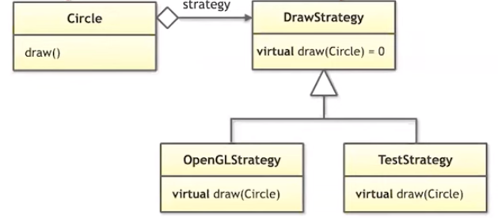

[Back to Basics: Designing Classes (part 1 of 2) - Klaus Iglberger- CppCon 2021](https://www.youtube.com/watch?v=motLOioLJfg)

[Back to Basics: Designing Classes (part 2 of 2) - Klaus Iglberger- CppCon 2021](https://www.youtube.com/watch?v=O65lEiYkkbc)

一期 Back to Basics，讲解类的设计，分了 2 期，这里就合在一起了。

P1 主要是设计类时的问题，P2 是如何设计一个类

 ## The Challenge of Class Design

设计类的难点在于：Change。

软件工程必须要接受频繁的更改，那么什么会导致 Change 呢？

- *依赖 Dependencies*

所以如果你是一个软件设计师，那么你需要遵循：

- **设计容易更改的类**
- **设计容易扩展的类**

这是宗旨，不光是设计类，所有跟代码有关的东西都要遵循。

## Design Guidelines

- 花费一些时间，给所有的实体起一个好的名字

标准库就有很多例子，比如：

```cpp
template <class T, std::size_t N>		// <- 这里的 N 改为 size 明显就会更好
struct array;
```

或者 `std::vector` 的命名，以前由于某些原因 vector 就称之为 vector，但是现在来看，vector 是线性代数的概念，我们并不能一眼看出 vector 是容器还是数值数组之类。

再例如，容器中的 `empty()` 方法，我们无法知道他是 action or query。

所以命名很重要。

## Design for Change and Extension

### 实际例子 - Shape

举个无聊的例子，设计图形类，一般会选择设计一个图形基类，然后再继承他：

```cpp
class Shape {
public:
    virtual draw() = 0;
};

class Circle : public Shape {...};

class Square : public Shape {...};
```

问题在于，这样实现就导致你的代码多了一层依赖，如果你之后想更改你的代码，比如从 openGL 更改为其他 API，就会变得很困难。

那么比较 naive 的解决方法是，

从 `Circle` 类再派生一些类出来实现，例如 `OpenGLCircle` , `MetalCircle`，自然每一个都要实现。

那么，如果现在 Shape 中再多一个方法呢？

```cpp
class Shape {
public:
    virtual draw() = 0;
    virtual serialize() = 0;
};
```

那可能对于每个派生出的类又要实现两个类，例如 `OpenGLLittleEndianSquare`, `OpenGLBigEndianSqurae`

你发现你的继承越来越复杂了，虽然你发现序列化的实现都是相似的，但你就是很难修改。

如果你使用这种 naive 方式解决，就会发生：

- 太多派生类
- 越来越难命名
- 更深的继承层次
- 相同实现的代码越来越多
- 几乎无法扩展

我们需要：

- 不要把所有东西都塞到一个类中，分开关键部分
- 如果使用面向对象编程，请你合适的使用
- 设计容易更改的类
- 设计容易扩展的类

> 1. Resist the urge to put everything into one class. Separate concerns.
> 2. If you use OO programming, use it properly.
> 3. Design classes for easy change.
> 4. Design classes for easy extensions.

### 解决问题

> Inheritance is Rarely the Answer. Delegate to Services: Has-A Trumps Is-A.
>
> ​													—— Andrew Hunt, David Thomas, The Pragmatic Programmer

解决之道在于设计的原则

- **Single-Responsibility Principle**
- **Open-Closed Principle**
- **Don't Repeat Yourself**

#### 单一责任原则 SPR

通俗的解释是：任何东西都应该只做一件事。

Klaus Iglberger 的解释是：SPR 建议关键点以隔离、简化变更

> The Single-Responsibility Principle advices to separate concerns to isolate and simplify change.

#### 开闭原则 OCP

开闭原则建议选择通过类型和操作**来简化扩展**的设计。

> The Open-Closed Principle advices to prefer design that simplifies the extension by types or operations.
>
> open for extensions but close for modification

#### 不要重复原则 DRY

减少重复以此减少变更。

> The DRY Principle advices to reduce duplication in order to simplify change.

推荐去看 GoF 的 23 种设计模式的书籍。

#### 使用 Strategy 模式解决问题

策略模式通常是对算法的封装，将算法和类解耦。



Circle **拥有** DrawStrategy

如果转化为代码，大概会是：

```cpp
class Shape {
public:
    Shape() = default;
    virtual ~Shape() = default;
    
    virtual void draw(...) const = 0;
    virtual void serialize(...) const = 0;
};

class Circle;

class DrawCircleStrategy {
public:
    virtual ~DrawCircleStrategy() {}
    
    virtual void draw(const Circle& circle, ...) const = 0;
};

class Circle : public Shape {
public:
    // 使用 unique ptr 保证所有权
    // 这里 strategy 也是依赖注入
    Circle(double r, std::unique_ptr<DrawCircleStrategy> strategy) :
    	radius(r), ..., drawing{std::move(strategy)} {}
    
    double getRadius() const noexcept;
    
    void draw(...) const override {
        drawing->draw(this, ...);
    }
    
    void serialize(...) const override;
    
private:
    double radius;
    std::unique_ptr<DrawCircleStrategy> drawing;
};

// Square 等同理
// 之后再使用 OpenGLDrawStrategy 等继承 DrawCircleStrategy

int main() {
    using Shapes = std::vector<std::unique_ptr<Shape>>;
    Shapes shapes;
    
    shapes.emplace_back( std::make_unique<Circle>( 2.0, std::make_unique<OpenGLCircleStrategy>() ) );
    ...
    drawAllShapes(shapes);
}
```

通过策略模式，我们满足：

- 解耦实现细节（SRP）
- 提供简单更改的机会
- 提供简单扩展的集合（OCP）
- 减少副本（DRY）
- 限制了继承深度
- 容易维护

你可能会说：这是90年代的东西，不是现代 C++。

确实，但是核心思想是不变的，例如你可以把 unique_ptr 直接换成 std::function，然后直接调用

当然，也可以通过模板参数来实现。

### 例子2 - 模板方法模式