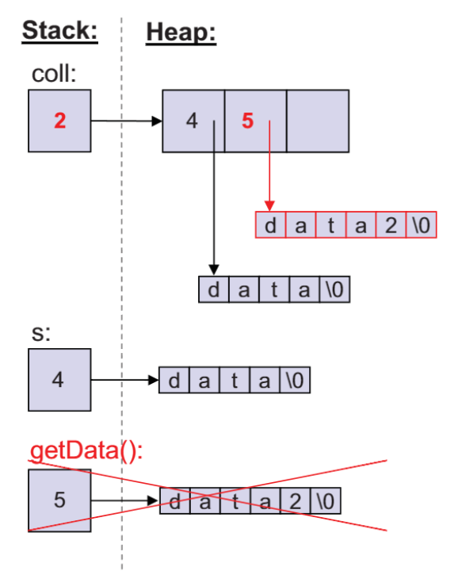
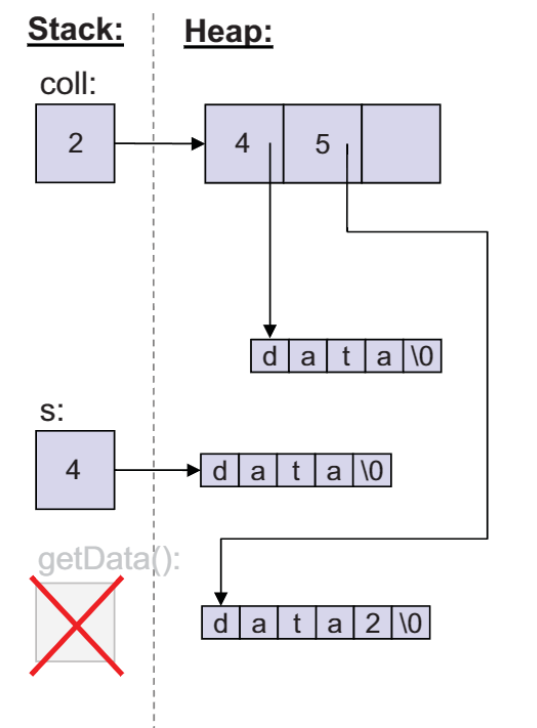
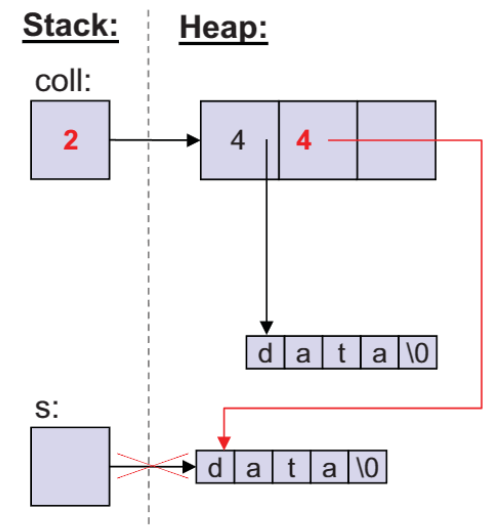
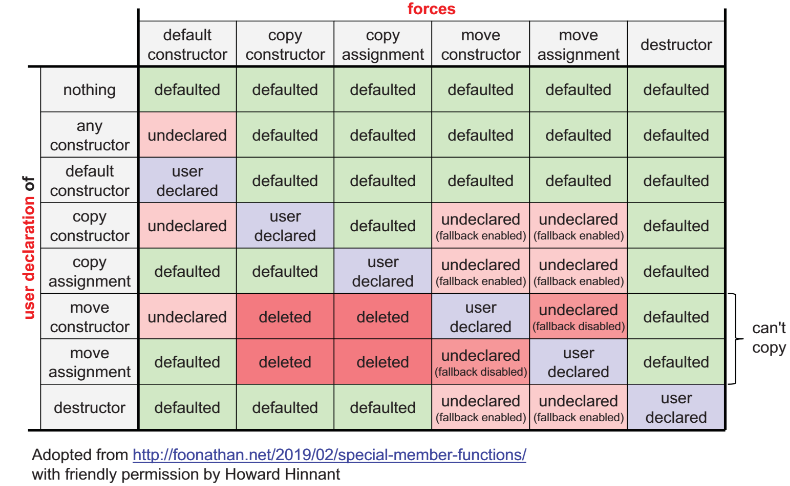

[Back to Basics: Move Semantics - Nicolai Josuttis - CppCon 2021](https://www.youtube.com/watch?v=Bt3zcJZIalk)

C++11 圣经之二 —— 移动语义。

> 我感觉大多数人不懂移动语义。

## 动机

首先来看当年的拷贝语义（C++98/03 年代）

```cpp
std::vector<std::string> coll;
coll.reserve(3);

// 假设返回的是一个很长的 string
std::string s{getData()};
coll.push_back(s);
coll.push_back(getData());
```



在以前的 C++，getData() 会返回一个临时对象，然后再被拷贝过去，然后再自己销毁。这显然没有什么意义，

在 C++ 11 之后，支持移动语义，那么编译器就不会再拷贝这个临时对象了，它只会 move 这个对象，类似于某些语言的浅拷贝。

很正常，因为我们也不会使用这个临时对象。

**之后调用析构函数，不过它并不会释放任何内存，因为已经被移动走了，只是单纯的销毁临时对象**。



这里告诉我们，可以**尽量使用不具有名字的对象**。（亡值）

## std::move

但显然，大部分时候对象都是具有名字的，不然会非常不方便管理。

```cpp
std::string str{getData()};
coll1.push_back(str);	// copy, 之后仍然需要 str
coll2.push_back(str);	// copy, 之后不需要 str
```

如果对象有名字（左值），那么会默认拷贝。

当你需要处理参数时：

```cpp
void reinit(std::string& s) {
    history.push_back(s);	// copy, 但你不需要 str 了
    s = getDefaultValue();
}
```

为了处理这些情况，我们有了函数 std::move

**std::move：我不再会需要这些值了。**move，并不 move，move 在语义上表示的是，你不再需要某些变量存在了。

```cpp
std::string str{getData()};
coll1.push_back(str);				// copy, 之后仍然需要 str
coll2.push_back(std::move(str));	// move, 之后不需要 str
```

----

那么回到之前的例子，有一个有趣的问题。

```cpp
std::vector<std::string> coll;
coll.reserve(3);

// 假设返回的是一个很长的 string
std::string s{getData()};
coll.push_back(s);
coll.push_back(std::move(s));	// move
```

move 后 s 的状态是什么？



**C++ 标准保证，对于 *标准库* 组件，move 后其处于 valid but unspecified 状态**。具体能否使用要依赖实现。

```cpp
std::cout << s; 	// ok, some value
int i = s.size()	// ok, 但你不知道 i 是什么
```

你可以 reuse move 后的对象

```cpp
std::vector<std::string> allRows;
std::string row;
while (std::getline(myStream, row)) {
    allRows.push_back(std::move(row));
}
```

## 右值引用

在 C++03：

容器全部都是**值语义**

- 新的元素会被拷贝进入容器
- 不会修改传递的参数

在 C++11 后：

使用右值引用你可以选择**移动语义**

右值引用绑定给右值：

- caller 不再需要 value
- 可能会 ***steal*** （代表 no const）但仍 valid

移动语义通常使用以下实现：

- 移动构造（优化拷贝）
- 移动赋值运算符（优化拷贝）

- steal 原来的对象，但仍然保持其 valid

## 引用的重载

```cpp
void foo(const T&);	// 只读
```

- 可以绑定所有变量
- 不会拷贝

```cpp
void foo(T&);		// 写
```

- 只能绑定 non-const 左值引用对象
- 可以更改对象

```cpp
void foo(T&&);		// move
```

- 传入一个你不再会使用的值
- 使用 std::move() 或者 临时对象

```cpp
void foo(const T&&)	// 语义冲突，不明觉厉
```

- 已经有 const T& 了为啥用这个？

## 类的移动语义

### 基本的移动支持

- 标准库保证：除非有其他的指明，否则默认的 moved-from 对象之后应该是 valid but unspecified 状态。

- 如果没有提供移动支持，那么会使用 copy 作为 fallback，当然你也可以选择 disable 这个。通常 move-only 类型是这么干的，比如 std::thread, std::unique_ptr

- 默认的移动语义支持：自动生成移动构造、移动赋值运算符，除非

  - 没有**用户声明**的复制构造函数
  - 没有**用户声明**的复制赋值运算符
  - 没有**用户声明**的析构函数

  

> 注意，用户声明包括 =default 这种，用户提供不包括。此外，=default =delete 都是函数定义。
>
> 此外，注意写 noexcept，vector 这样的容器在 resize 扩容时会使用 std::move_if_noexcept，来决定是调用移动还是拷贝构造。

### 多态类型中的移动

**声明虚析构函数**会抑制移动的生成。

## 完美转发

考虑以下情况，

```cpp
class C {...};

void foo(const C&);
void foo(C&);
void foo(C&&);

C v;
const C c;
foo(v);		//-> foo(C&)
foo(c);		//-> foo(const C&)
foo(C{});	//-> foo(C&&)
foo(std::move(v))	//-> foo(C&&)
```

完美，没有问题。

那么假设我们需要一个中间层来调用 foo，

```cpp
class C {...};

void foo(const C&);
void foo(C&);
void foo(C&&);

void callFoo(const C& x) {
    foo(x);			//-> foo(const C&)
}
void callFoo(C& x) {
    foo(x);			//-> foo(C&)
}
void callFoo(C&& x) {
    foo(std::move(x));	//-> foo(C&&)
}

C v;
const C c;
callFoo(v);		//->foo(C&)
callFoo(c);		//->foo(const C&)
callFoo(C{});	//->foo(C&&)
callFoo(std::move(v)) //foo(C&&)
```

我们自然不想写三个重载，可以使用模板，那样就需要使用完美转发。

想使用模板转发，那么你需要：

1. **模板参数**
2. 模板形参声明为 &&

```cpp
template<typename T>
void callFoo(T&& arg) {
    foo(std::forward<T>(arg));
}
```

arg 称为 universal (or forwarding) reference

## emplace 中的完美转发

```cpp
template<typename T, ...>
class vector {
public:
    ...
	template<typename... Args>
    void emplace_back(Args&&... args) {
    	place_element_in_memory( T(std::forward<Args>(args)...) );
    }
};

class Cust {
private:
    std::string first;
    std::string last;
    int val;
public:
    Cust(...)...{}
}

std::string first{"Jil"};
std::string last{"Cook"};
std::vector<Cust> cv;

cv.emplace_back(std::move(first), last, 39);
// 不需要 first，直接移动
// last 拷贝
// 39 拷贝
```

## 完美转发返回值

如果你想对返回值使用完美转发，那么

- 声明返回值为 auto&&
  - 也是万能引用
- forward

```cpp
// 直接使用
process(compute(t));


// 或者如果你需要使用参数的话:
auto&& val = compute(t);
...;
process(std::forward<decltype(val)>(val));
```

万能引用可以存储一切，包括引用性和常量性。

## ranges 和完美转发

- `const views` 可能不支持迭代，因为迭代中他们可能修改自身的状态。这时你需要万能引用

```cpp
template<typename T>
void print(const T& coll) {				// 将其改为 T&& 即可
    for (const auto& elem : coll) {
        std::cout << elem << '\n';
    }
}

std::vector vec{1, 2, 3, 4, 5};
print(vec);								// ok
print(vec | std::views::drop(3));		// ok
print(vec | std::views::filter(...));	// bad
std::list lst{1, 2, 3, 4, 5};
print(lst | std::views::drop(3));		// bad
```

