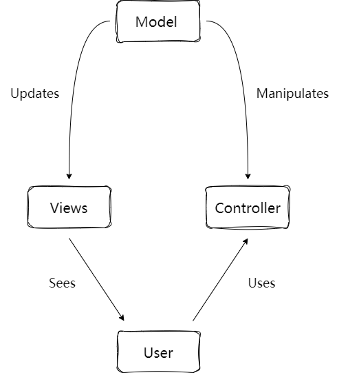
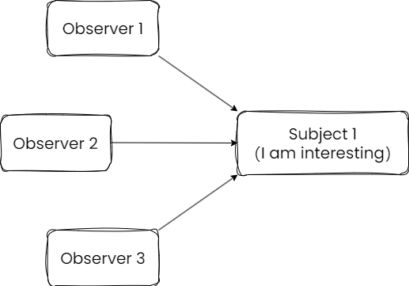
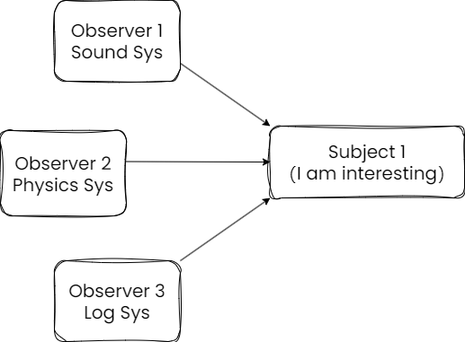

[The Observer Design Pattern in Cpp - Mike Shah - CppCon 2022](https://www.youtube.com/watch?v=4GU2YNsHrwg)

可以说是最最常用的设计模式了。

## 引入

以愤怒的小鸟为例，讨论游戏的 subsystem

```cpp
// pesudo code --angrybirds.cpp
void BirdSlingshot() {
    SimulateBirdPhysics();
    
    if(CheckCollisions()) {
        PlaySoundBirdNoise();
        
        if(HitObject Pig) {
            UpdateScore();
            
            PlayPigSound();
            
            SimulateObjectPhysics(pig);
        }
        
        LogResult();
    }
}
```

这段代码显然逻辑嵌套什么的比较多，我们可以使用一些技巧来修复它。

## 设计模式

一段好的代码应该

- 灵活性
- 可维护性
- 可扩展性

设计模式基本上是一些可重用的模板，帮助我们解决一些软件工程中经常遇到的问题。

## Model, View, Controller(MVC)

MVC 模型和我们即将讨论的观察者模式适应性很好。核心是将程序分为 3 个主要部分。

- Model

  模式的中心组件，是程序的动态数据结构，独立于用户接口。它直接管理数据、逻辑以及程序执行规则。

- View

  信息的表示方式，例如图表，图，或者表。可能有多个 views 用来表示相同的信息。

- Controller

​	接受输入，并且将其转换为 model 或者 view 的命令。



##  观察者模式

### 观察者模式基础实现

观察者模式是指一个对象，称为 subject，维护了一个依赖列表，称之为 observers，当其状态改变时会自动通知 observers。通常的实现是调用其一个方法。

其中，subject 是你想要追踪的对象，observer 是想要根据其状态做出反应的对象。

经典的情况是，subject 和 observer 是一对多的关系。

有时，subject 也叫做 Publisher，observer 也叫做 Subscriber



简单的实现如下：

```cpp
class Subject {
public:
    void AddObserver(Observer* observer) {
        observers_.push_front(observer);
    }
    
    void RemoveObserver(Observer* observer) {
        observers_.remove(observer);
    }
    
    void Notify() {
        for (auto& o : observers_) {
            o->OnNotify();
        }
    }
private:
    std::forward_list<Observer*> observers_;
};

class Observer {
public:
    Observer(std::string name) name_(name) {}
    
    void OnNotify() {
        std::cout << name_ << "Hello~" << std::endl;
    }
private:
    std::string name_;
};
```

但这只是个基础的实现，并不具备什么灵活性、扩展性，也许可以维护？

### 第二次尝试

现在我们将 Subject 转换为 ISubject，其作用于 IObserver

```cpp
class ISubject {
public:
    ISubject() {}
    virtual ~ISubject() {}
    
    virtual void AddObserver(IObserver* observer) {
        observers_.push_front(observer);
    }
    
    virtual void RemoveObserver(IObserver* observer) {
        observers_.remove(observer);
    }
    
    virtual void Notify() {
        for (auto& o : observers_) {
            o->OnNotify();
        }
    }
private:
    std::forward_list<IObserver*> observers_;
};

class SomeSubject : public ISbuject {
public:
    
};

class IObserver {
public:
    virutal ~IObeserver() {}
    virtual void OnNotify() = 0;
};

class Watcher : public IObserver {
public:
    Watcher(std::string name) name_(name) {}
    
    void OnNotify() {
        std::cout << name_ << "Hello~" << std::endl;
    }
private:
    std::string name_;
};
```

这次比上次好一点，但仍需要更强大的灵活性。

subject 仍然需要 more power.

### 第三次尝试

现在，我们的每一个观察者都可能是一个特殊的系统。而此时 Subject 自然也需要存储不同类型的信息。



```cpp
// Subject 可以处理不同类型的 messages/events/keys 
// 让我们的 Subject 支持不同的子系统，但是仍然解耦
class ISubject {
public:
    virtual void AddObserver(int msg, IObserver* observer) {
        auto it = observers_.find(msg);
        if (it == observers_.end()) {
            observers_[msg] = ObserversLists();
        }
        observers_[msg].push_front(observer);
    }
    
    virtual void NotifyAll() {
        for (ObserversMap::iterator it = observers_.begin(); it != observers_.end(); ++it) {
            for (auto& o : observers_[it->first]) {
                o->OnNotify();
            }
        }
    }
    
    virtual void Notify(int msg) {
        for(auto& o : observers_[msg]) {
            o->OnNotify();
        }
    }
    
private:
    // 两个 typedef，一个用于存储 observer list
    // 还有一个 map，int 作为 key，区别不同类型的系统
    using ObserversList = std::forward_list<IObserver*>;
    using ObserversMap = std::map<int, ObserversList>;
    ObserversMap oberservers_;
};

// 我们需要决定 message 的类型
class SomeSubject : public ISubjecet {
public:
    enmu MessageTypes{PLAYSOUND, HANDLEPHYSICS, LOG};	// 为了方便所以用了 enum 而不是 enum class
    
}

class SoundEvent : public IObserver {
public:
    explicit SoundEvent(const std::string& name) : name_(name) {}
    
    void OnNotify() {
        std::cout << name_ << "Sound engine do...\n";
    }
    
    std::string GetName() const override {return name_;}
private:
    std::string name_;
};

class PhysicsEvent : public IObserver {
public:
    explicit SoundEvent(const std::string& name) : name_(name) {}
    
    void OnNotify() {
        std::cout << name_ << "Physics engine do...\n";
    }
    
    std::string GetName() const override {return name_;}
private:
    std::string name_;
};
```

现在就非常灵活，并且也可维护，扩展性也很好。

## 观察者模式的其他 tip

- 一些 C++ 方面改进
  - 智能指针
  - enum class
- 使用其他结构替代 std::forward_list
  - 也许 observer 需要按一定权重排序（priority_queue）
  - 也许 observer 需要常量时间查找（unordered_map）

