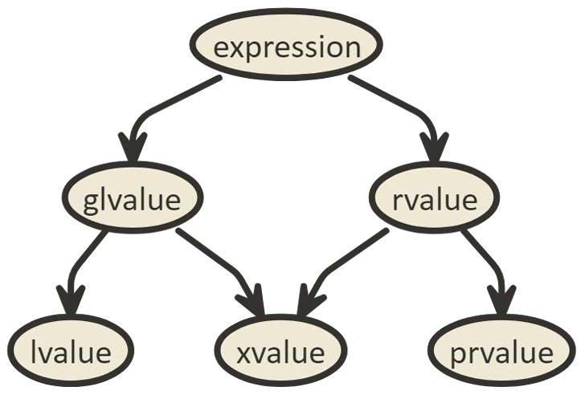

[Back to Basics: Forwarding References - How to Forward Parameters in Modern C++ - Mateusz Pusz  2023 (youtube.com)](https://www.youtube.com/watch?v=0GXnfi9RAlU)

[Slides](https://github.com/CppCon/CppCon2023/blob/main/Presentations/B2B_Forwarding_References.pdf)

最近写模版，所以回顾一下万能引用。

（感觉这个主讲人是德国口音，有点喜感hhh）

## 值类别



- "Generalized" Lvalues：lvalue 是具有 *identity* 的对象、位域或者函数。
- "Pure" Rvalues：prvalue 是运算符和操作数*计算的结果*，或者对象的*初始化*，或者位域
- "Expiring" Lvalue：xvalue 代表可以被重用的资源（你应该对他使用 move，当然 别 return std::move）

之后主讲人发起了个 quiz，做题，以下传入的表达式的值类别是什么？

```cpp
foo(42);	// prvalue
```

```cpp
int i{42};
foo(i);		// lvalue
```

```cpp
int i{42};
foo(std::move(i));	// xvalue
```

```cpp
int make_int() {return 42;}
foo(make_int());	// prvalue。译者注：函数调用是纯右值
```

接下来是重载的选择：

```cpp
void f(int* ptr);
void f(const int* ptr);

int i{42};
const int ci{42};
int make_int() {return 42};

// 以下那些可以编译？
f(i);
f(ci);
f(std::move(i));
f(std::move(ci));
f(42);
f(make_int());
```

**都不能编译**，因为函数参数是指针。为了让他能编译，我们需要取地址，继续：

```cpp
void f(int* ptr);

int i{42};
const int ci{42};
int make_int() {return 42};

f(&i);				// √
f(&ci);				// ×
f(&std::move(i));	 // ×
f(&std::move(ci));	 // ×
f(&42);				// ×
f(&make_int());		 // ×
```

```cpp
void f(const int* ptr);

int i{42};
const int ci{42};
int make_int() {return 42};

f(&i);				// √
f(&ci);				// √
f(&std::move(i));	 // ×
f(&std::move(ci));	 // ×
f(&42);				// ×
f(&make_int());		 // ×
```

```cpp
void f(int& ref);

int i{42};
const int ci{42};
int make_int() {return 42};

f(i);				// √
f(ci);				// ×
f(std::move(i));	 // ×
f(std::move(ci));	 // ×
f(42);				// ×
f(make_int());		 // ×
```

```cpp
void f(const int& ref);

int i{42};
const int ci{42};
int make_int() {return 42};

// 全能编译
f(i);				
f(ci);				
f(std::move(i));	
f(std::move(ci));	 
f(42);				
f(make_int());		 
```

## 指针 vs. 引用

| Ptr                    | Ref               |
| ---------------------- | ----------------- |
| 是对象                 | Alias（不是对象） |
| 总是占用内存           | 一般不占用内存    |
| 数组的指针合法         | 数组不能创建引用  |
| 指针的指针             | 引用不能引用引用  |
| void 指针              | 不能引用 void     |
| 可以未初始化           | 必须初始化        |
| 初始化之后可以重新赋值 | 不能更改          |
| 可以 cv 修饰           | 不能 cv 修饰      |

> 我看看谁再说引用的本质是指针。

```cpp
void f(int&& ref);

int i{42};
const int ci{42};
int make_int() {return 42};

f(i);				// ×
f(ci);				// ×
f(std::move(i));	 // √
f(std::move(ci));	 // × const int&&
f(42);				// √
f(make_int());		 // √
```

```cpp
void f(const int&& ref);	// 很奇怪，但确实合法，但确实看起来没有用

int i{42};
const int ci{42};
int make_int() {return 42};

f(i);				// ×
f(ci);				// ×
f(std::move(i));	 // √
f(std::move(ci));	 // √ 
f(42);				// √
f(make_int());		 // √
```

## 传参

```cpp
void foo(const int& x) {
    int temp = x;
    x = 0;	// Error
}
foo(make_int());
```

- const lvalue **不能被修改**
- 即使你传的是右值也不行

所以 C++11 加入了右值引用，为了解决这个情况

```cpp
void foo(int&& x) {
    int temp = x;
    x = 0;	// OK
}

foo(make_int());
```

- 右值**可以**被修改
- **暗示移动语义**

## 右值引用类型的参数

右值引用的变量在表达式中被使用时，是**左值**

```cpp
void boo(int&& x);

void foo(int&& x) {
    boo(x);	// error
}
```

如果你想让他生效，你得 move 一下

```cpp
void boo(int&& x);

void foo(int&& x) {
    boo(std::move(x));	// error
}
```

> 所以实际上你在参数中看到右值，那么你需要使用移动语义。如果你是传参的那个，看到参数接受右值，那么也代表你在之后最好不要复用传入的参数。

此外，`std::move` 也并不 move，只是 cast to rvalue type。

## 万能引用

万能引用的形式有如下两种：

```cpp
template<typename T> void f(T&& x);
void f(auto&& x);
```

要求是：

1. 推导语境
2. 声明为右值（长得一样）
3. 无 cv 限定

比如：

以下这些**都不是**万能引用

```cpp
template<typename T>
int g(const T&& y);

template<typename T>
struct A {
	template<typename U, typename Z = T>
    A(T&& t, U&& u, Z&& z); // 'u' 'z' 是万能引用，t 不是推导语境
};

template<typename T>
void foo(std::vector<T>&& v);

auto&& z = {1, 2, 3};	// initializer list 在哪都特殊
```

```cpp
template<typename T>
void f(T&& x);

int i{42};
const int ci{42};
int make_int() {return 42};

f(i);				// f<int&>(int&)
f(ci);				// f<const int&>(const int&)
f(std::move(i));	 // f<int>(int&&)
f(std::move(ci));	 // f<const int>(const int&&)
f(42);				// f<int>(int&&)
f(make_int());		 // f<int>(int&&)
```

注意引用折叠：当传入的参数是左值时，万能引用此时会推导为 T&。可以跟以下对比：

```cpp
template<typename T>
void f(const T& x);

int i{42};
const int ci{42};
int make_int() {return 42};

f(i);				// f<int>(const int&)
f(ci);				// f<int>(const int&)
f(std::move(i));	 // f<int>(const int&)
f(std::move(ci));	 // f<int>(const int&)
f(42);				// f<int>(const int&)
f(make_int());		 // f<int>(const int&)
```

## 推荐做法

如果你需要一个函数，可以绑定所有的类型，但是只是读取数据，那么你应该使用 `const T&` (当然，各种 range 也可以)

## 转发函数的参数

假设我们实现一些功能：

```cpp
void f(int&) {std::cout << "lvalue\n"; }
void f(const int&) {std::cout << "const lvalue\n"; }
void f(int&&) {std::cout << "rvalue\n"; }
```

我们需要处理数据，然后把他们传入参数，我们总不能对每个函数都写个 wrapper 吧？所以我们需要完美转发。

**完美转发可以保留函数参数的值类别**，通过 `std::forward` 转发给别的函数。

```cpp
template<typename T>
void wrapper(T&& v) {
    do_something();
    f(std::forward<T>(v));
}
```

`std::forward` **只会将右值保留为右值**

简单实现：

```cpp
template<typename T>
[[nodiscard]] constexpr T&& forward(std::type_identity_t<T>& param) {
    return static_cast<std::type_identity_t<T>&&>(param);
}
```

注：`std::type_identity` 用于**建立非推导语境。**正常的 `forward` 实现也是非推导语境，所以你需要手动指定模板类型参数。

## Sinks: 可扩展性

```cpp
class MyClass {
public:
    explicit MyClass(const std::string& txt) : txt_(txt) {}
    explicit MyClass(std::string&& txt) : txt_(std::move(txt)) {}
private:
    std::string txt_;
};
```

考虑这种情况，那么显然重载两个构造函数是最好的。

但是这么做缺乏可扩展性，如果你的成员多了，那得重载多少个构造函数？

所以你可以考虑使用值类型，这样让用户来决定传什么：

```cpp
class MyClass {
public:
    explicit MyClass(std::string txt1, std::string txt2) : 
    	txt1_(std::move(txt1)), txt2(std::move(txt2)) {}
private:
    std::string txt1_;
    std::string txt2_;
};
```

但如果你的类型移动开销高的话，那可能你也不想用这种方法，那你需要完美转发：

```cpp
class MyClass {
public:
    template<typename T, typename U>
    MyClass(T&& txt1, U&& txt2) : 
    	txt1_(std::forward<T>(txt1)), txt2(std::forward<U>(txt2)) {}
private:
    std::string txt1_;
    std::string txt2_;
};
```

但这样的话还有别的问题，别人**不知道你到底需要什么类型**，没准给你传个int 或者 double 进来，

那么你就需要一些 Concepts

```cpp
class MyClass {
public:
    template<std::same_as<std::string> T, std::same_as<std::string> U>
    MyClass(T&& txt1, U&& txt2) : 
    	txt1_(std::forward<T>(txt1)), txt2(std::forward<U>(txt2)) {}
private:
    std::string txt1_;
    std::string txt2_;
};
```

此时如果我传一些 `std::string` 左值，他就不会工作了，why？

```cpp
std::string txt{"abc"};
MyClass c(txt, txt);
```

明显 `std::string` 和推导出的 `std::string&` 不是一个类型。所以你还得 remove cvr。

```cpp
class MyClass {
public:
    template<typename T, typename U>
    	requires std::same_as<std::remove_cvref_t<T>, std::string>&&
    			std::same_as<std::remove_cvref_t<U>, std::string>
    MyClass(T&& txt1, U&& txt2) : 
    	txt1_(std::forward<T>(txt1)), txt2(std::forward<U>(txt2)) {}
private:
    std::string txt1_;
    std::string txt2_;
};
```

那么传 `const char[]` 也不能过编译，所以我们也不能这么干，应该写：

```cpp
class MyClass {
public:
    template<std::convertible_to<std::string> T, std::convertible_to<std::string> U>
    MyClass(T&& txt1, U&& txt2) : 
    	txt1_(std::forward<T>(txt1)), txt2(std::forward<U>(txt2)) {}
private:
    std::string txt1_;
    std::string txt2_;
};
```

此外，可以使用 `std::convertible_from` 允许显式转换。

## 问题，以下的代码？

```cpp
class int_or_empty {
    int value_{};
    bool empty_{true};
    
public:
    int_or_empty() = default;
    
    template<std::convertible_to<int> T>
    constexpr int_or_empty(T&& v) : value_{std::forward<T>(v)}, empty_{false} {}
    
    constexpr bool empty() const {return empty_;}
    constexpr operator int() const {return value_;}
}
```

这个代码有点像 optional。

```cpp
int_or_empty empty;	// It is empty
int_or_empty one{1}; // It 1

int_or_empty empty2{empty};	// 不行，因为 empty 可以隐式转换为 int
                        	// 但如果 empty 是 const 就可以，因为这样不能转换了
                            // 即使你有拷贝构造也不可以
```

这个问题主讲称之为：“Too perfect forwarding”

```cpp
class int_or_empty {
    int value_{};
    bool empty_{true};
    
public:
    int_or_empty() = default;
    
    template<std::convertible_to<int> T>
    	requires (!std::same_as<std::remove_cvref_t<T>, int_or_empty>)
    constexpr int_or_empty(T&& v) : value_{std::forward<T>(v)}, empty_{false} {}
    
    constexpr bool empty() const {return empty_;}
    constexpr operator int() const {return value_;}
}
```

你还是得约束一下。

## 推荐做法

**如果构造函数参数是 完美转发的 单个模板参数 或者 一个参数包**，一定要注意，他们可能会劫持你的拷贝构造。

 ## T&& 和移动语义

如果我就想接受右值引用，不想让他是万能引用怎么办？

```cpp
template<typename T>
void foo(T&&);

std::vector obj {1, 2, 3};
const std::vector cobj {1, 2, 3};

foo(obj);	// 不想编译
foo(cobj);	// 不想编译
foo(std::move(obj));			// rvalue √
foo(std::move(cobj));			// rvalue √
foo(std::vector{1, 2, 3});		// rvalue √
```

这里显然委员会的设计有问题（确实，之前nikolai 讲移动语义的时候也提到了，他们在设计完美转发的时候不太成熟就放出来了）

你需要约束一下：

```cpp
template<typename T>
	requires (!std::is_lvalue_reference_v<T>)	// 这里 T 会被推导为 std::vector<int>&，这样就可以避免左值时的调用了 
void foo(T&&);

std::vector obj {1, 2, 3};
const std::vector cobj {1, 2, 3};

foo(obj);	// ×
foo(cobj);	// ×
foo(std::move(obj));			// rvalue √
foo(std::move(cobj));			// rvalue √
foo(std::vector{1, 2, 3});		// rvalue √
```

只使用 `std::is_reference_v<T>` 是不行的，因为有的人可能会显示调用这个函数（`foo<std::vector<int>&&>(v)`）

## 捕获参数

协程的状态存储协程参数：

- by-value 那么参数会 move 或者 copy
- by-reference 那么依然会是引用

所以你给协程传参时要注意生命周期，不然可能会悬垂引用。那怎么办呢？

```cpp
template<typename T>
task<void> foo(T&& t) { ... }

template<typename U>
task<void> boo(U&& u) {
    return foo(std::forward<U>(u));
}

int main() {
    int i{123};
	co_await boo(i);	// T -> int&; t -> int&
	co_await boo(42);	// T -> int;  t -> int&&
}
```

`co_await boo(i)` 没问题，因为 i 存在于函数的栈上。但如果是临时变量，它就释放了。

所以 foo 那个协程，根据上面的规则，保留了引用（即使是右值引用）那么生命周期就会出问题。

那该咋办呢？

```cpp
template<typename T>
task<void> foo(T t) { ... }
```

其他都不变，这样就可以了。此时 

```cpp
co_await boo(42);	// T -> int; t -> int
```

这样就可以直接拷贝，不会有右值引用的生命周期问题了。

## 完美的返回参数

```cpp
template<typename T>
auto wrapper(T&& v) {
    return foo(std::forward<T>(v));
}
```

`auto` 并不行，他总是会想返回值。`auto&&` 也不好，我们应该使用：

```cpp
template<typename T>
decltype(auto) wrapper(T&& v) {
    return foo(std::forward<T>(v));
}
```

这样 `decltype(auto)` 会在返回临时变量的时候返回值，返回引用的时候返回引用。

当然，也可能需要先完美转发，再完美的返回。

```cpp
template<typename T>
decltype(auto) wrapper(T&& v) {
    auto&& ret = foo(std::forward<T>(v));
    return foo2(std::forward<decltype(ret)>(ret));
}
```

## 这是万能引用吗？

``` cpp
for (auto&& x : f()) {
    // ...
}
```

在泛型语境中，使用 `auto&&` 来遍历 for 循环是最安全的。

## 总结

- **只读**情况下使用 `const MyClass&` 
- 一起使用 `const MyClass&` and `MyClass&&` 在移动消耗不高的情况下
  - 使用 `MyClass` 开销比较大时考虑
- 使用 `T&&` 来转发参数
  - **注意接收一个参数的构造函数**
  - 记住它会**绑定一切**而不是仅仅你想要的类型
  - 记住**它不是右值引用**
- 使用 `decltype(auto)` 作为函数的返回类型来**完美返回**另外一个函数的调用结果
- 使用 `auto&&` 来**存储一会要转发的万能引用**
  - 一般在**泛型语境的 range-based-for 中使用**
