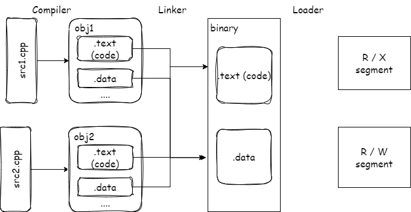

[Linkers, Loaders and Shared Libraries in Windows, Linux, and C++ - Ofek Shilon - CppCon 2023 - YouTube](https://www.youtube.com/watch?v=_enXuIxuNV4)

## 术语

演讲使用同一个术语指代不同平台下的事物，

- 动态库（Shared Library）

  指代：shared object, dynamic object, dynamic shared object, DLL, dynamic shared library

- 二进制文件（Binary）

  指代：可执行文件 / 动态库，模块，组件

- 符号（Symbol）

  指代：函数 / 全局变量

- Linux

  指代：所有 unix-like 系统，大部分情况下包括 MacOS（有一个不同）

 ## 链接简介

源文件经过编译器处理之后，就变成了 object 文件，它包含了一堆区域，存放了程序的代码、数据等等。链接器做两件事，把分散在不同 object 文件中的同名区域放在一起，把它们拼接成更大的区域；其次把这些区域重排，把对运行时有类似需求的区域在硬盘上相邻排列。最后，loader 把这些相邻的区块取出，称之为段，以页对齐的要求映射到内存中。映射之后，调整每个段的权限。

