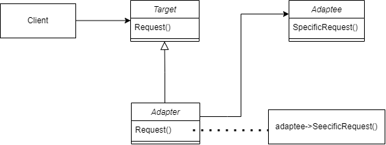

本文介绍适配器模式，参考了 https://www.bilibili.com/video/BV1Yr4y157Ci

## 适配器模式

### 类图



- Target: 未来的接口（我们希望的接口）
- Adaptee：被适配者（老的接口）
- Adapter 继承自 Target（继承代表我遵循基类的接口规范），同时有一个组合 Adaptee（组合是支持实现的方式）

Adapter 实现了 Adaptee to Target

即：**继承新接口，组合老接口。**

### 简单实现

```cpp
// 目标接口（新接口）
class ITarget {
public:
	virtual void process() = 0;
};

// 遗留接口（老接口）
class IAdaptee {
public:
	virtual void foo(int data) = 0;
	virtual int bar() = 0;
};

class OldClass : public IAdaptee {
public:
	//.... 实现了 IAdaptee 方法的遗留类
	void foo(int data) {}
	int bar() {}
};

class Adapter : public ITarget {
protected:
	IAdaptee* adaptee_;

public:
	Adapter(IAdaptee* adaptee) : adaptee_(adaptee) {}
	virtual void process() {
		// 转换的过程，伪代码
		// 实际可能非常复杂
		int data = adaptee_->bar();
		adaptee_->foo(data);
	}
};
```

```cpp
#include "adapter.hpp"

int main() {
	IAdaptee* adaptee = new OldClass();

	ITarget* target = new Adapter(adaptee);

	target->process();
}
```

举个例子，STL 中 dequeue 是 queue 和 stack 的适配器，把 dequeue 转换为了 stack 和 queue 要求的接口。

强调的是一个接口转换，老接口转为目标接口。

### 总结

希望复用一些现存的类，但是接口又与复用环境要求不一致的情况。我们举例的是对象适配器，**组合了对象**，更符合设计模式的宗旨。