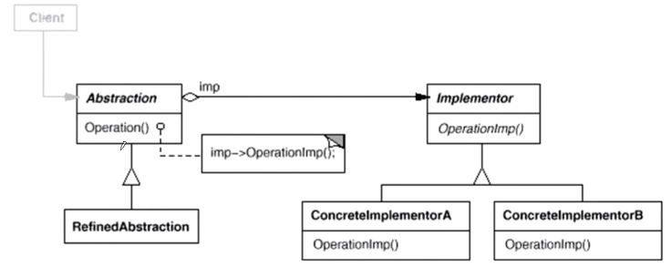

本文介绍 桥 模式，参考了 https://www.bilibili.com/video/BV1Yr4y157Ci

## 目的

由于某些类型的固有实现逻辑，使得它们具有多个变化的纬度。

## 示例

```cpp
class Messager {
public:
    virtual void Login(string username, string password) = 0;
    virtual void SendMessage(string message) = 0;
    virtual void SendPicture(Image image) = 0;
    
    virtual void PlaySound() = 0;
    virtual void DrawShape() = 0;
    virtual void WriteText() = 0;
    virtual void Connect() = 0;
    virtual ~Messager() {}
};
```

那么我们可能会需要考虑很多平台的实现。

```cpp
class PCMessagerBase : public Messager {
public:
    virtual void PlaySound() {}
    virtual void DrawShape() {} 
    virtual void WriteText() {}
    virtual void Connect() {}
};

class MobileMessagerBase : public Messager {
public:
    virtual void PlaySound() {}
    virtual void DrawShape() {} 
    virtual void WriteText() {}
    virtual void Connect() {}
};
```

我们可能要推出精简版，或者完美版

```cpp
class PCMessagerLite : public PCMessagerBase {
public:
    virtual void Login(string username, string password) {
        PCMessagerBase::Connect();
        // ...
    }
    virtual void SendMessage(string message) {
        PCMessagerBase::WriteText();
        // ...
    }
    virtual void SendPicture(Image image) {
        PCMessagerBase::DrawShape();
        // ...
    }
};

class PCMessagerPerfect : public PCMessagerBase {
public:
    virtual void Login(string username, string password) {
        PCMessagerBase::PlaySound();
        PCMessagerBase::Connect();
        // ...
    }
    virtual void SendMessage(string message) {
        PCMessagerBase::PlaySound();
        PCMessagerBase::WriteText();
        // ...
    }
    virtual void SendPicture(Image image) {
        PCMessagerBase::PlaySound();
        PCMessagerBase::DrawShape();
        // ...
    }
};
```

```cpp
class MobileMessagerLite : public PCMessagerBase {
public:
    virtual void Login(string username, string password) {
        MobileMessagerBase::Connect();
        // ...
    }
    virtual void SendMessage(string message) {
        MobileMessagerBase::WriteText();
        // ...
    }
    virtual void SendPicture(Image image) {
        MobileMessagerBase::DrawShape();
        // ...
    }
};

class MobileMessagerPerfect : public PCMessagerBase {
public:
    virtual void Login(string username, string password) {
        MobileMessagerBase::PlaySound();
        MobileMessagerBase::Connect();
        // ...
    }
    virtual void SendMessage(string message) {
        MobileMessagerBase::PlaySound();
        MobileMessagerBase::WriteText();
        // ...
    }
    virtual void SendPicture(Image image) {
        MobileMessagerBase::PlaySound();
        MobileMessagerBase::DrawShape();
        // ...
    }
};
```

那么我使用时就需要

```cpp
void Process() {
    Messager *m = new MobileMessagerPerfect();
}
```

如果我们的抽象多了，那么类的数目又会增加很快。何况这些类里面重复的东西又很多。

如果我们使用装饰器模式中的继承转为组合，会好吗？可以。

我们可以合并 MessagerLite 类 和 MessagerPerfect 类，但会出现问题，因为两个 fooBase 的基类有问题，它是一个抽象类，因为没有全部实现基类接口，所以问题出现在 Messager 类上。参考如下代码

```cpp
class Messager {
public:
    virtual void Login(string username, string password) = 0;
    virtual void SendMessage(string message) = 0;
    virtual void SendPicture(Image image) = 0;
    
    virtual void PlaySound() = 0;
    virtual void DrawShape() = 0;
    virtual void WriteText() = 0;
    virtual void Connect() = 0;
    virtual ~Messager() {}
};

class PCMessagerBase : public Messager {
public:
    virtual void PlaySound() {}
    virtual void DrawShape() {} 
    virtual void WriteText() {}
    virtual void Connect() {}
};

class MobileMessagerBase : public Messager {
public:
    virtual void PlaySound() {}
    virtual void DrawShape() {} 
    virtual void WriteText() {}
    virtual void Connect() {}
};

class MessagerLite {
    Messager* messager;
public:
    virtual void Login(string username, string password) {
        messager->Connect();
        // ...
    }
    virtual void SendMessage(string message) {
        messager->WriteText();
        // ...
    }
    virtual void SendPicture(Image image) {
        messager->DrawShape();
        // ...
    }
};

class MessagerPerfect {
    Messager* messager; // = new PCMessagerBase/MobileMessagerBase
public:
    virtual void Login(string username, string password) {
        messager->PlaySound();
        messager->Connect();
        // ...
    }
    virtual void SendMessage(string message) {
        messager->PlaySound();
        messager->WriteText();
        // ...
    }
    virtual void SendPicture(Image image) {
        messager->PlaySound();
        messager->DrawShape();
        // ...
    }
};

```

我们可以把它拆开，然后再正确的继承

```cpp
class Messager {
public:
    virtual void Login(string username, string password) = 0;
    virtual void SendMessage(string message) = 0;
    virtual void SendPicture(Image image) = 0;
    virtual ~Messager() {}
};

class MessagerImpl {
public:
    virtual void PlaySound() = 0;
    virtual void DrawShape() = 0;
    virtual void WriteText() = 0;
    virtual void Connect() = 0;
    virtual ~MessagerImpl() {}
};

class PCMessagerBase : public MessagerImpl {
public:
    virtual void PlaySound() {}
    virtual void DrawShape() {} 
    virtual void WriteText() {}
    virtual void Connect() {}
};

class MobileMessagerBase : public MessagerImpl {
public:
    virtual void PlaySound() {}
    virtual void DrawShape() {} 
    virtual void WriteText() {}
    virtual void Connect() {}
};

class MessagerLite : public Messager {
    MessagerImpl* messager;
public:
    virtual void Login(string username, string password) {
        messagerImpl->Connect();
        // ...
    }
    virtual void SendMessage(string message) {
        messagerImpl->WriteText();
        // ...
    }
    virtual void SendPicture(Image image) {
        messagerImpl->DrawShape();
        // ...
    }
};

class MessagerPerfect : public Messager {
    MessagerImpl* messagerImpl; // = new PCMessagerBase/MobileMessagerBase
public:
    virtual void Login(string username, string password) {
        messagerImpl->PlaySound();
        messagerImpl->Connect();
        // ...
    }
    virtual void SendMessage(string message) {
        messagerImpl->PlaySound();
        messagerImpl->WriteText();
        // ...
    }
    virtual void SendPicture(Image image) {
        messagerImpl->PlaySound();
        messagerImpl->DrawShape();
        // ...
    }
};
```

之后可以再提一次：

```cpp
class Messager {
protected:
    MessagerImpl* messagerImpl;
public:
    virtual void Login(string username, string password) = 0;
    virtual void SendMessage(string message) = 0;
    virtual void SendPicture(Image image) = 0;
    virtual ~Messager() {}
};

class MessagerImpl {
public:
    virtual void PlaySound() = 0;
    virtual void DrawShape() = 0;
    virtual void WriteText() = 0;
    virtual void Connect() = 0;
    virtual ~MessagerImpl() {}
};

class PCMessagerImpl : public MessagerImpl {
public:
    virtual void PlaySound() {}
    virtual void DrawShape() {} 
    virtual void WriteText() {}
    virtual void Connect() {}
};

class MobileMessagerImpl : public MessagerImpl {
public:
    virtual void PlaySound() {}
    virtual void DrawShape() {} 
    virtual void WriteText() {}
    virtual void Connect() {}
};

class MessagerLite : public Messager {
public:
    virtual void Login(string username, string password) {
        messagerImpl->Connect();
        // ...
    }
    virtual void SendMessage(string message) {
        messagerImpl->WriteText();
        // ...
    }
    virtual void SendPicture(Image image) {
        messagerImpl->DrawShape();
        // ...
    }
};

class MessagerPerfect : public Messager {
public:
    virtual void Login(string username, string password) {
        messagerImpl->PlaySound();
        messagerImpl->Connect();
        // ...
    }
    virtual void SendMessage(string message) {
        messagerImpl->PlaySound();
        messagerImpl->WriteText();
        // ...
    }
    virtual void SendPicture(Image image) {
        messagerImpl->PlaySound();
        messagerImpl->DrawShape();
        // ...
    }
};
```

此外修改一下构造函数即可，委托给父类。

```cpp
MessagerImpl* imp = new PCMessagerImpl();
Messager* m = new MessagerLite(imp);
```

## 桥模式

将抽象部分（业务）与实现部分（平台实现）分离，使得它们可以独立变化。



