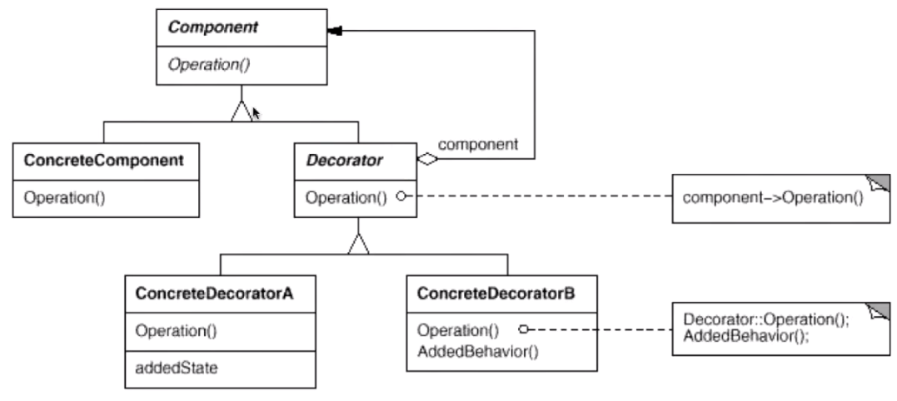

本文介绍 装饰器模式 模式，参考了 https://www.bilibili.com/video/BV1Yr4y157Ci

## 实例

某些情况下可能会过度使用集成。

```cpp
class Stream {
public:
    virtual char Read(int number) = 0;
    virtual void Seek(int pos) = 0;
    virtual void Write(char data) = 0;
};

class FileStream : public Stream {...};
class MemoryStream : public Stream {...};
class NetworkStream : public Stream {...};

// 此时我们想向流加密
class CryptoFileStream : public FileStream {
public:
    virtual char Read(int number) {
        FileStream::Read(number);
        // 其他加密工作
    }
    ...
};

// 想引入缓冲
class BufferedFileStream : public FileStream {
public:
    virtual char Read(int number) {
        FileStream::Read(number);
        // buffer
    }
    ...
};
```

难道给每个流都派生一个类吗？如果再做 buffer 呢？如果又加密又要缓冲呢？

我们可以使用 组合 而不是 继承

```cpp
class CryptoFileStream {
	FileStream* stream;
public:
    virtual char Read(int number) {
        stream->Read(number);
        // 其他加密工作
    }
    ...
};
```

而这时，又有圣旨，**如果你的类中的成员都是一些子类，那么可以不用声明它为子类了**，可以利用多态，在运行时支持。

```cpp
// 继承的作用是完成接口的规范
// 这里很奇妙，既有基类，又有字段
class CryptoStream : public Stream {
	Stream* stream;		// new FileStream();
public:
    CryptoStream(Stream* strm) : stream(strm) {}
    virtual char Read(int number) {
        stream->Read(number);
        // 其他加密工作
    }
    ...
};

class BufferedStream : public Stream {
	Stream* stream;		// new FileStream();
public:
    BufferedStream(Stream* strm) : stream(strm) {}
    virtual char Read(int number) {
        stream->Read(number);
        // 其他缓存工作
    }
    ...
};
// 此时发现 File、Network、Memory流代码都一样，也就是说可以直接省略。
// 未来也有各种各样的 Stream 可以支持变化。
```

也就是说，让代码在编译时尽量复用，然后在运行时支持其他的不同特性！

使用方法如下：

```cpp
FileStream* fs = new FileStream();
CryptoStream* cs = new CryptoStream(fs);
BufferedStream* bs = new BufferedStream(fs);
BufferedStream* cbs = new BufferedStream(cs);
```

如果你追求完美的话，可以把类中的 Stream 字段提出来，显然不能提到基类里，因为 FileStream 当然不需要 Stream 这种字段，所以再封装一层中间类 DecoratorStream，CryptoStream和BufferedStream 继承，之后委托构造。

装饰代表扩展，什么是扩展？在已有的 Stream 上进行其他操作，这也是 装饰器模式 的含义。

## 关系变化

此时的类图由本来疯狂的继承产生的树状变成了：


组合可以更好的完成我们的目的。

## 装饰器模式

某些情况下，我们可能会过度使用继承来为类实现扩展功能，继承会引入**静态的特性**。

动态（**使用组合**）地给一个对象增加一些额外的职责。就增加功能而言，Decorator 模式比生成子类（继承）更灵活。



通过组合而非集成，装饰器模式实现了在 **运行时** 动态扩展对象功能的能力，而且可以根据需要继续扩展。避免了使用继承的灵活性差。

**装饰器模式在接口上表现为 is-a Component 的继承关系**，即 Decorator 继承了 Component 类的接口。

**但在实现中装饰器模式又表现为 has-a Component 的组合关系**，即 Decorator 又使用了另外一个 Component 类。

非常精妙。

Decorator 模式为了解决：主题类在多个方向上的扩展功能。