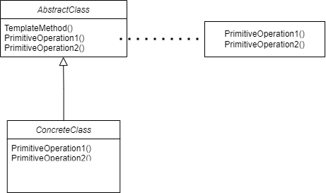

本文介绍 模版方法 模式，参考了 https://www.bilibili.com/video/BV1Yr4y157Ci

## 目的

在软件构建过程中，对于某个任务，它可能拥有**稳定的**整体操作结构，但各个子步骤却有**很多改变的需求**。

假设我们有一个库，以及一个应用

```cpp
class Library {
public:
    void Step1() {}
    
    void Step3() {}
    
    void Step5() {}
};

class Application {
public:
    void Step2() {}
    
    void Step4() {}
};
```

这种情况下，通常 Library 的使用步骤是固定的，而要构建程序又需要 App 的步骤。如果什么都不做，每次就要都写一遍固定的 Library 步骤。而框架开发人员完全可以把开发步骤写下来。

```cpp
class Library {
public:
    void Run() {
        Step1();
        
        if(Step2()) {	// 支持多态 -> 虚函数调用
            Step3();	
        }
        
        for (int i = 0; i < 4; ++i) {
            Step4();	// 支持多态 -> 虚函数调用	
        }
        Step5();
    }
    
    virtual ~Library() {}
private:
    void Step1() {}	// 稳定
    
    void Step3() {} // 稳定
    
    void Step5() {} // 稳定
protected:
    virtual bool Step2() = 0;
    virtual bool Step4() = 0;
};

class Application : public Library {
public:
    virtual void Step2() {}
    
    virtual void Step4() {}
};

int main() {
    Library* lib = new Application();
    lib->Run();
    delete lib;
}
```

这一次就可以利用多态，直接调用了。

## 软件设计流程

### 第一种方式

Library 开发人员：

- 步骤 1, 3, 5 的开发

Application 开发人员：

- 步骤 2， 4 开发
- **程序主流程**

调用关系：Application 调用 Library

### 第二种方式

Library 开发人员：

- 步骤 1， 3， 5的开发
- **程序主流程**

Application 开发人员：

- 步骤2， 4开发

调用关系：利用虚函数，Library 调用 Application

### 对比

也就是说，第一种方法是早绑定，app 晚，lib 早，app 调用 lib。

在面向对象语言中，有一种机制叫做晚绑定，lib 早，app 晚，但是 lib 反过来调用 app。这样叫做**晚绑定**。

## 模板方法定义

定义一个操作中的算法的**骨架（稳定）**，而将一些步骤**延迟（变化，也就是指定义虚函数，让子类重写虚函数）**到子类。

template method 设计模式可以使子类可以不改变（复用）一个算法的结构，即可重定义（override）该算法的某些步骤。

模板方法最重要的点在于，**必须有一个稳定的骨架**。设计模式的最大意义就是在**变化和稳定**间寻找隔离点，将其分离，便于管理变化。



## 总结

模板方法是一个非常常用、基本的模式。为很多框架提供了灵活的**扩展点**（继承+虚函数）。

机制非常简洁。