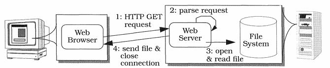

# 什么是 Proactor 模式

本文摘录自 \<Pattern-Oriented Software Architecture: Patterns for Concurrent and Networked Objects> 215 - 226页内容，作者是 《Unix网络编程》 的作者。

恰好 Linux 更新了 io_uring，原生支持异步I/O，终于可以和 Windows 一样实现 Proactor 模式了，再加上 C++20 的协程，想必对于满大街的 Reactor 来讲，还是占据一定优势的。

所以我们来一起阅读一下吧。

本部分只译概念性内容，实现部分暂时不考虑。

## Proactor

> *Proactor* 模式允许事件驱动应用程序通过 *异步操作完成* *（Completion of Asynchronous Operations）* 触发来提升解多路复用（Demultiplex）以及分配（Dispatch）服务器请求的效率。 这样即可在没有额外开销的情况下享受到并发的效益。

## Example

考虑一个网络应用程序，必须同步执行多个操作，例如一个高性能的 Web Server 处理从浏览器发来的 HTTP 请求。当一个用户想从 URL 中下载内容时会发生：

1. 浏览器与服务器建立连接，之后发送 HTTP GET 请求。
2. 服务器收到浏览器的 CONNECT 事件，接受连接，读取并分析请求。
3. 服务器打开并读取相应文件。
4. 最后，服务器发送读取的内容给浏览器，并关闭连接。

一种实现方法是使用 Reactor 模型完成。这种设计中，不管浏览器什么时候连接到服务器，都会创建一个新的 event handler 来读取、分析、处理请求，并且将内容发回。handler 被注册到 reactor 以此来协调同步的解多路复用以及和其他关联的 event handler 的分配。

虽然 reactive 服务器的设计很简单，但他对于大量用户并发或者长连接的用户请求情景下效果不好，因为他要在 event 解多路复用层序列化所有的 HTTP 请求，导致同一时刻只有一个 GET 请求会被分配并且处理。

一个比较好的解决方式可能是使用多线程同步。在这种模型中，服务器会使用单独的线程来对 HTTP GET 请求进行处理。例如，可能对于每个请求都新建一个线程，或者使用线程池配合 Leader/Followers 或者 Half-Sync/Half-Async 模式来管理。在这种情况下，每个线程都会执行建立连接、HTTP 请求读取、分析、*同步* 传回内容，也就是说，**服务器会在处理完所有操作前阻塞**。

同步多线程是一种简单的并发模型。然而，其效率、可扩展性、编程难度、可移植性等都成问题，就像前文 Ractor 模式的讨论中一样。

在支持异步 IO 的操作系统中，可以异步操作让我们的服务器更加有效率。例如，Windows NT 中，服务器可以通过调用 WIn32 异步操作来处理外部生成的事件，例如 TCP 连接、HTTP GET 请求、同步发送文件。

当这些异步操作完成时，操作系统会返回相关联的 completion events，包含服务器的结果，服务器会在返回事件循环前完成这些处理。编写使用异步事件模型驱动的程序是很难的，因为其异步操作的调用和其顺序完成在时间和空间上是分开的。也就是说，异步编程需要一个复杂的事件解多路复用以及分配机制。

### Context

异步接受和处理多个请求的事件驱动应用（event-driven application）。

### Problem

事件驱动应用程序的性能，尤其是服务器，在分布式系统中通常可以通过异步处理多个请求来提升。当异步服务器执行计算时，应用程序必须解决相应的由操作系统分配的代表异步操作结束的 completion events。

例如，应用程序必须解多路复用并且向内部每个处理异步操作的组件分配 completion event。这个组件可以与外部客户端沟通，例如浏览器客户端，或者 to internal clients，例如服务器中发起异步操作的组件。为了支持异步操作，必须要有四个*forces*：

- 为改善可扩展性和延迟，应用程序必须同时处理多个 completion events，不应让一个需要很长时间的操作来过分阻塞其他的操作执行。
- 为了最大化吞吐量，任何不必要的上下文切换、同步、CPU间的数据移动应该都被避免，就像 Example 中一样。
- 在已有的 completion events 解多路复用和分配机制上集成新的或者增加服务时需要的额外工作尽量小。
- 应用程序代码应该和背后复杂的多线程以及同步机制间分割。

### Solution

将应用服务器分为两部分：需要大量时间的异步执行操作；当这些操作执行完毕时对其进行处理的 completion handler。集中异步操作完成后传递的解复用的 completion events，之后分配给对应的 completion handlers 进行处理。将 completion event 解复用和分配机制与 completion handlers 解耦。

