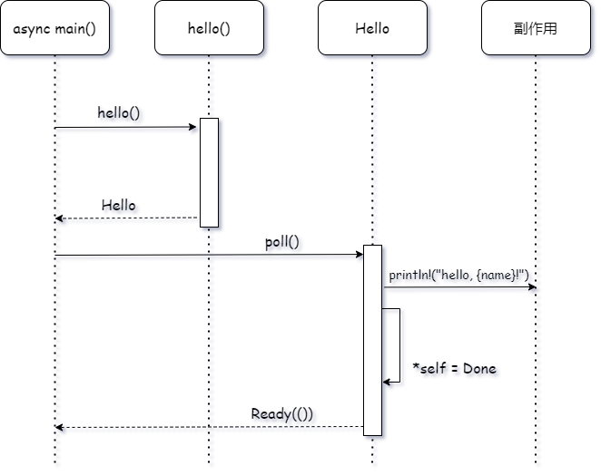

本文是系列博客 How I Finally Understood async/await in Rust - p1 的精读翻译，只翻译了重要的内容。

原博客：[how I finally understood async/await in Rust (part 1) - hēg denu - Hayden Stainsby (hegdenu.net)](https://hegdenu.net/posts/understanding-async-await-1/)

## 序言

我一开始并不能理解 `async`, `.await` 这两个关键字背后的魔法，这使得我困惑于为什么我要写这样的代码？

我想要分享一下最终我是怎么理解 Rust 的异步的。

我们会探索一些我遇到过的问题，共四篇文章。

首先需要回答的问题是

## 为什么要写一个关于 async/await 的教程

目前已经有很多 beginner 教程了，为什么我还要写呢？从个人的角度来说，这些文章都没有让我顿悟。这也很正常，因为每个人都有不同的学习方式，可能没有文章能突然让你顿悟，或者你可能理解不了某些部分，然后你需要阅读一些其他文章补足这些部分。

这些文章记录了我最终是如何理解异步的，如果能帮到你那就最好了。

其他的文章推荐：

- [Let's talk about this async](https://conradludgate.com/posts/async) by Conrad Ludgate
- [Pin and suffering](https://fasterthanli.me/articles/pin-and-suffering) by Amos (fasterthanlime)
- [How to think about `async`/`await` in Rust](https://cliffle.com/blog/async-inversion/) by Cliff L. Biffle

## 为什么如果我不使用 await，就无事发生？

刚接触 Rust 异步的新人可能会遇到的第一个问题就是，什么都没发生。

```rust
tokio::time::sleep(std::time::Duration::from_millis(1000));
```

这并不会 sleep，编译	器会警告你这行代码无法正常工作：

```rust
 = note: futures do nothing unless you `.await` or poll them
```

我们来修复它：

```rust
tokio::time::sleep(std::time::Duration::from_millis(1000)).await;
```

好了现在就可以正常 sleep 了。但，为什么？

通常调用一个普通函数会立刻执行其函数体，那 `async` 函数特殊在哪呢？

为了理解这个，我们来看一个简单的异步函数

## 最最简单的异步函数

我们来启动一个并不异步的异步函数，看起来可能很蠢，但会帮助我们理解问题：

```rust
async fn hello(name: &'static str) {
    println!("hello, {name}");
}
```

然后我们需要在一个异步上下文中调用这个函数：

```rust
#[tokio::main]
async fn main() {
    hello("world").await;
}
```

现在就可以正常运行了。

我们都知道，如果移除了 `.await` 那么函数就不会执行，为什么呢？

我们来写一个自己的 future 完成这个事情，

特别地，我们需要实现 trait `std::future::Future`。

什么是 future？

> future 代表了异步计算，直到操作完成你都可以一直持有 future，future 可以让你稍后访问计算的结果。
>
> 这是一个在任何语言中都常见的通用的概念。
>
> future 的名字于 1977 年被提出，也并不是什么新东西了。([Futures_and_promises](https://en.wikipedia.org/wiki/Futures_and_promises))
>
> 我们需要知道的是，future 允许你使用异步运行时。通过 `.await`ing 它，运行时会在稍后把结果给你。

## 最最简单的 future

让我们把最简单的异步函数改为一个 future，一个 future 一般来讲有几个状态。

实际上，大多数 future “基本上是” 状态机。

状态机通过异步运行时来驱动它的状态，最少也需要两个状态，`Init` ，`Done`

`Init` 状态是 future 的起始状态，`Done` 是 future 完成后的状态。非常简单。

所以我们的 future 会建模为 `enum`

在 `Init` 状态，我们需要保存传递给异步函数的参数。

```rust
enum Hello {
    Init {name: &'static str},
    Done,
}
```

> 这怎么跟 C++ 协程这么像。协程本身确实也带有异步的色彩，但更灵活。

## 状态转换图

根据以上：future 就是一个状态机，我们可以画出状态转换图


之后实现 poll 的时候我们会写代码。

总而言之，我们的 `Hello` 枚举在构造时就会转换为 `Init` 状态，某些东西调用它的 `poll()`，将其转换为 `Done` 状态。

现在，对象仅能够被 `dropped`。

目前它还不是个 future，所以也不能被 await，我们需要为其实现 Future trait

> 这个跟 C++20 协程真的真的非常像，应该不是我思维混淆了吧。

## 简单版本的 Future trait

我们先看一看比较简单的 `std::future::Future` trait

首先，看一下：

```rust
pub trait Future {
    type Output;
    
    // 要求
    fn poll(self: Pin<&mut Self>, cx: &mut Context<'_>) -> Poll(Self:Output);
}
```

`Future` trait 声明了关联类型 `Output`，这是异步函数返回的类型。我们的 hello 函数什么都不返回，所以暂时跳过这里。

还有一个方法，其参数接收一个 `self` 的可变引用以及一个可变的 `Context`，`self` 的引用被 pin 住。

现在我们还不需要理解 pin，现在需要理解的是 `&mut self`，目前也不需要 `Context`，故跳过。

`poll` 方法返回的是 `std::task::Poll` 枚举，该方法在仍然有工作没完成的情况下返回 `Pending`，当 future 可以返回时，就返回 `Ready(T)`。`T` 就是 `Future` 的关联类型 `Output`。

以上，暂时不理解的地方都先跳过即可。

## 实现 poll

```rust
use std::{future::Future, pin::Pin, task::Context};

impl Future for Hello {
    type Output = ();
    
    fn poll(mut self: Pin<&mut Self>, _cx: &mut Context<'_>) -> Poll<Self::Output> {
        match *self {
            Hello::Init {name} => println!("hello, {name}!"),
            Hello::Done => panic!("Please stop polling me~"),
        };
        
        *self = Hello::Done;
        Poll::Ready(())
    }
}
```

我们一点一点的看，首先我们的异步函数不返回值。

这意味着 `Output` 使用 unit type `()`

实际开发中，我们的异步函数通常都是这样。

让我们看看 `poll` 的实现，关注点在 `*self` 上，记住，`Hello` 是一个枚举。

如果我们处于初始状态 `Init`，那么就打印 `hello, {name}!`，这是我们异步函数的函数体。

如果我们处于 `Done` 状态，就 panic。

在 match 语句之后，我们将状态设置为 `Done`. 最后，返回 `Ready(())`

记住，不返回任何值的函数实际上返回的是 unit type。

然后，我们来看看怎么使用，但首先需要讨论一下 pending。

关于是 `Poll::Pending` 和 `panic!`

## pending futures

这个 future 非常简单，第一次被 poll 时会变成 ready 状态。

但如果情况不是这样呢？

这就是 `Poll::Pending` 的作用，之后我们会看如何使用 `Pending`。

## future panic

panic 是干什么的？

future 是一个 one shot 对象。一旦完成，就会返回 `Ready(T)`，然后就不能再调用它了。

官方文档的描述如下：

> ##### Panics
>
> Once a future has completed (returned `Ready` from `poll`), calling its `poll` method again may panic, block forever, or cause other kinds of problems; the `Future` trait places no requirements on the effects of such a call. However, as the `poll` method is not marked `unsafe`, Rust’s usual rules apply: calls must never cause undefined behavior (memory corruption, incorrect use of `unsafe` functions, or the like), regardless of the future’s state.

trait 并不强制要求 future panic，但实践中这是一个比较符合逻辑的操作。

## 使用 future

我们需要构造 future 然后使用它，先将其包装成一个异步函数

```rust
fn hello(name: &'static str) -> impl Future<Output = ()> {
    Hello::Init{ name }
}
```

注意到这个函数 **没有** 被标记 `async`，这是因为我们正在使用一个手写的 future，不需要 `async` 关键字。

所以我们返回的是 `impl Future<Output = ()>`

翻译：实现了 Future trait 且关联类型对象是 unit type 的对象。

我们也可以直接返回 `Hello`，效果是一样的，因为 `Hello` 也实现了 `Future` trait.

函数体呢？

我们构造了枚举中的 `Init` 状态然后返回它，现在，异步函数如果不 await 就不会执行任何行为的原因就很清楚了。

因为我们本来也什么都没干，只是返回了一个构造出的对象，啥都没运行。

我们要调用我们的 future，我们不能直接调用 `poll()`，因为没有传给他的 `Context`。

（我们也不能创建一个 `Context`，不过这个以后再说。记住我们要理解的是如何使用 `async/await`，而不是异步运行时）

幸运的是，`await` 关键字在我们手写的 future 上也可以正确运行。

以下是 main 函数，注意关键字 `async`，我们必须在 await future 的语境中使用。

```rust
#[tokio::main]
async fn main() {
    hello("world!").await;
}
```

很无聊，运行结果和之前的异步函数是一样的。

## 时序图

`Hello` future 的时序图：



看起来我们的 `async main()` 没有直接调用 `poll()`，但要记住，main 也是被 polled，所以它可以调用 Hello 的 `poll()`。

（指拥有 context ，但现在先不讨论 context）

