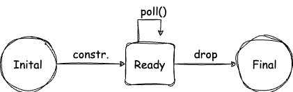
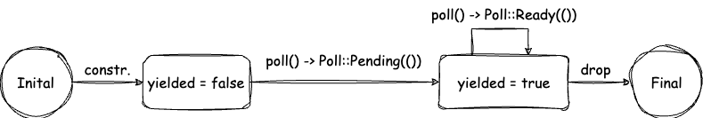

本文是系列博客 How I Finally Understood async/await in Rust - p2 的精读翻译，只翻译了重要的内容。

原博客：[how I finally understood async/await in Rust (part 2) - hēg denu - Hayden Stainsby (hegdenu.net)](https://hegdenu.net/posts/understanding-async-await-2/)

## 序言

这是**我**理解 Rust async/await 的系列文章之二，你并不是我，但我希望这篇文章可以帮助你。

之前的文章，我们了解了最简单的异步函数，然后我们写了一个自定义的 future，通过这个 future，我们理解了为什么我们的 future **是异步**的；为什么在被 awaited 前它不会执行任何东西。在前文中，一个很重要的部分被我们跳过了。

我们的 future 只返回 `Poll::Ready`，那么 pending 的 future 呢？我们来看看返回 `Poll::Pending` 会怎么样。

## 如何唤醒 pending 的 future

首先，我们回顾一下 future 被 poll 的时候发生了什么。

可以创建一个比上一节更简单的 future。

## Ready future

这个 future 除了返回 `Poll::Ready` 外，什么都不会做。

我们甚至都不需要给它实现什么成员。

所以我们一个 unit struct，给它实现 `Future`

```rust
use std::{future::Future, task::Poll};

struct Ready;

impl Future for Ready {
    type Output = ();

    fn poll(self: std::pin::Pin<&mut Self>, cx: &mut std::task::Context<'_>) -> Poll<Self::Output> {
        println!("Ready: Poll");
        Poll::Ready(())
    }
}
```

我们不需要返回值，所以 Output 是 unit 类型 `()`。`Poll` 的实现也非常简单，单纯的返回一个 `Poll::Ready(())`

虽然它已经很简单了， 但我们还是看一下他的状态图。



显然，这个 future 里没有 state。此外，如果这个 future 被不正确的多次 poll 也没有任何处理的后续。

总而言之，它非常简单。

现在，我们把 future 包装成一个函数。

```rust
fn ready() -> Ready {
  Ready{}
}
```

我们返回的是一个实现了 `Future` trait 的 Ready unit 结构图，因为它实现了 `Future`，所以我们可以 `await` 它。

（不要把这个 Ready future 和 `Poll::Ready` 混淆）

```rust
use std::{future::Future, task::Poll};

struct Ready;

impl Future for Ready {
    type Output = ();

    fn poll(self: std::pin::Pin<&mut Self>, cx: &mut std::task::Context<'_>) -> Poll<Self::Output> {
        println!("Ready: Poll");
        Poll::Ready(())
    }
}

fn ready() -> Ready {
    Ready {}
}

#[tokio::main]
async fn main() {
    println!("Before ready().await!");
    ready().await;
    println!("After ready().await");
}
```

在 `.await` 的背后，是 poll 函数被调用了，它直接返回 `Poll::Ready`，结果直接被返回给 caller。为了完整性，以下是使用 `Ready` future 的时序图。


这个 future 在你只想要一个永远返回 Ready 的 future 的测试的时候很有用，实际上，其他人也这么想。

在 futures crate 中有一个泛型版本的 [futures::future::ready](https://docs.rs/futures/latest/futures/future/fn.ready.html)

我们想知道的不仅仅是返回 `Poll::Ready`，我们继续。

## Pending future

我们来实现 `Ready` future 的另外一个版本，这一次让它返回 pending，我们把这个结构体也命名为 `Pending`，之后为其实现 `Future` trait.

```rust
struct Pending;

impl Future for Pending {
    type Output = ();

    fn poll(self: std::pin::Pin<&mut Self>, cx: &mut std::task::Context<'_>) -> Poll<Self::Output> {
        println!("Pending: poll()");
        Poll::Pending
    }
}

fn pending() -> Pending {
    Pending {}
}
```

同理，不要把这个 Pending 结构体和 `Poll::Pending` 搞混。

> 你可能会问，为什么在函数中包装 futures 呢？
>
> 有两个原因。首先是因为风格，在这个系列的博客中，我们一直在探讨 `async/await` 背后到底发生了什么，所以把函数和函数放在一起对比比较好。总之，就是看到一个能被 await 的函数就像是 async 函数原本应该是的样子。
>
> 原因二是抽象，如果在我们自己的函数中构造 future，我们可以把 API 细节对用户隐藏，甚至阻止用户从我们的 crate 或者 模块 外部构造我们的 future，这可以让兼容性提高。甚至，我们不需要返回我们的 future 类型，只是返回某些直线了 `Future` trait 的对象即可。
>
> ```rust
> fn pending() -> impl Future<Output = ()> {
> Pending {}
> }
> ```
>
> 可以看到，我们完全不需要让 `Pending` 是 public。

我们并不需要关注我们的返回类型到底是什么（`Pending` / `impl Future<Output = ()>`），我们试试刚才实现的 future。

结果会是：

```
Before poll().await!
Pending: poll()
```

这个程序永远不会终止，它也不会吃满 CPU，也不会阻塞任何线程，但它只能执行到这里。

`poll()` 只被调用了一次。看起来这个 future 是有问题的，但它也能在很多场景下发挥作用，比如测试。

就像上一节的 `ready()` 一样，在 futures crate 中也有一个泛型版本的 pending，`futures::future::pending`。

为什么 `Pending` 会让我们的程序挂起？

看一下状态图。


我们在通往 Final 的箭头上使用了虚线，代表它永远不会被 drop。

时序图如下，


也很明确。

为什么我们的程序不会继续执行了呢？我们发现我们的 future 返回了 `Poll::Pending` 给我们的 `async main()` 函数，然后没有看到后面的 `println!()` 被调用，我们需要深入的了解一下背后发生了什么。

## 解构 async main

我们需要了解 `async main()` 到底是怎么工作的。

尤其是宏 `#[tokio::main]` 做了什么。

这一部分是 `.await` 背后的行为，我们看看这个宏

```rust
fn main() {
  let body = async {
    println!("Before pending().await");
    pending().await;
    println!("After pending().await");
  };
  
  return tokio::runtime::Builder::new_multi_thread()
  		.enable_all()
  		.build()
  		.expect("Failed building the Runtime")
  		.block_on(body);
}
```

可以通过 Rust Analyzer 的宏展开来查看。

我们可以看到原来的函数体会自动被放进一个 async 函数块内，之后创建一个新的运行时并且把 async 函数块给它来执行。

（使用 `block_on` 来把 future 给运行时，并等待它执行完。）

一个 async 块也是一个 future。

现在我们就知道 async main 到底做了什么了，所以可以升级一下我们的时序图。


可以看到，实际上是异步运行时替我门调用了 `poll()` ，main future await pending future，还有一点很重要，当一个 future await 了另外一个返回 `Poll::pending` 的 sub-future 的时候，它自己也会给 caller 返回 `Poll::Pending`。

> Roses: 这是一个串联的任务关系。

这种情况下，会返回到异步运行时，当任务被 poll 然后返回 `Poll::Pending` 后，任务自身会 sleep。

之后异步运行时会选择另外一个任务来 poll（当然也有可能 poll 到同一个 task，如果它准备好了的话）

（被调度 poll 意味着 被唤醒）

这种情况下，异步运行时会 park 线程直到任务被唤醒。

问题来了：什么时候任务会被唤醒？

答案：当 waker 唤醒它的时候。

那么什么是 waker？怎么获得一个 waker？

## The Waker

提到 waker 的时候，指的均是 `std::task::Waker`. 它是一个标准库提供的结构体，文档的说法是：waker 是在任务准备好时通知其执行器唤醒任务的一个 handle。

我们知道了可以用 waker 来唤醒任务。你需要在任务的 waker 上调用 `wake()` 或者 `wake_by_ref()`。

之后任务会被唤醒然后继续被 poll。

如何为我们的任务写一个 waker？

这需要我们深入 p1 中被跳过的 context。

## Context

The context is the way that information about the current async task is given to a future.

我们讨论的是 `std::task::Context`，虽然在 p1 中它被跳过了，但实际上它并不复杂。文档的描述是：目前，`Context` 只提供 `&Waker` 来唤醒当前的任务。

就这么简单。

实际上，context 只有两个方法，第一个是 `from_waker()`，通过 waker 的引用来构造一个 context；第二个是 `waker()`，接收 context 的引用如何返回 waker 的引用。

实际上，我认为 `Context` 的构造只是出于未来 API 的设计。

我们来实现一个不会一直 pending 的 future 吧。

## 不会永远 pending

我们用最简单的方法来实现一个 future，返回 `Poll::Pending`，但不会一直挂起我们的程序。

有两个需要更改的地方，一个是只返回一次 `Poll::Pending`，但这还不够，`poll()` 不会在任务被唤醒的时候调用，所以第二步是唤醒我们的任务。我们可以在返回 `Poll::Pending` 前做这个。

（这是最简单的方式，在 tokio-console 中被称之为 self wake）

我们把这个 future 称之为 `YieldNow`，与 `Ready` 和 `Pending` 不同，我们需要它有一些状态。

来看一下代码，

```rust
struct YieldNow {
    yielded: bool,
}

impl Future for YieldNow {
    type Output = ();

    fn poll(
        mut self: std::pin::Pin<&mut Self>,
        cx: &mut std::task::Context<'_>,
    ) -> Poll<Self::Output> {
        println!("YieldNow: poll()");
        if self.yielded == true {
            return Poll::Ready(());
        }

        self.yielded = true;
        cx.waker().wake_by_ref();

        Poll::Pending
    }
}
```

`YieldNow` 只有一个字段，决定了我们有没有 yielded。这个语境下 yielding 代表控制流返回给异步运行时。如果我们已经 yielded，那么就返回一个 `Poll::Ready`；如果没有的话，就把这个字段设置为 true，之后我们唤醒 waker，最后，返回 `Poll::Pending`。

但我们已经唤醒了我们的任务，这表示任务准备好再次被 poll 了。

现在任务不会被阻塞了，然后把它包装到函数中：

```rust
fn yield_now() -> YieldNow {
    YieldNow { yielded: false }
}
```

现在我们的输出会是：

```rust
Before yield_now().await
YieldNow: poll()
YieldNow: poll()
After yield_now().await
```

我们可以清楚的看到 poll 被调用了两次。

## Yield Now

正如前文提到的，我们把将控制流返回给运行时称之为 **yielding**。

每次在 await 点返回 `pending` 时都会发生。

（如果你有自定义的 future 直接调用了 `poll()`，可能不适用于这种情况）

我们的 `yield_now()` 是自愿把控制权让给运行时的。自愿是因为这个任务实际上没有等待任何事情，可以继续执行。

这个函数的命名来自于 Tokio, `tokio::task::yield_now`.

我们来看看它的状态图。



我们把 `poll()` 的返回值也在转换图中包括了进去，future 从 yielded = false 开始，第一次被 poll 时，返回 `Poll::Pending()` 并且将状态转换为 `yielded = true`，之后，future 会在下一次调用 poll 时返回 `Poll::Ready(())`，这个状态机没有特别复杂，有意思的部分是时序图，来看一下。


`YieldNow` future 和 `Pending` future 很像，直到他对 waker 调用了 `wake_by_ref()`，之后 waker 调用异步运行时的 `schedule()` 来恢复执行当前任务

（并不是完全跟 tokio 内部发生的事情吻合）

现在，任务已经被调度了。

于是我们看到了它与返回 `Poll::Pending` 的任务的区别。异步运行时现在有了一个任务准备去 poll，所以并不会 park 线程，而是又一次直接 poll 任务。这一次，我们的 `YieldNow` future 返回了 `Poll::Ready`，因为我们调用 `block_on` 的任务已经完成了，所以运行时把控制流返回到 `main()`，之后返回 future 的值。

虽然这里是一个 unit type。

现在我们已经理解了 pending 的 future 是怎么被唤醒了！
