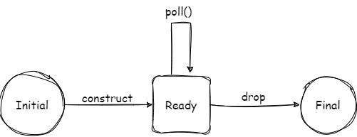

本文是系列博客 How I Finally Understood async/await in Rust - p2 的精读翻译，只翻译了重要的内容。

原博客：[how I finally understood async/await in Rust (part 2) - hēg denu - Hayden Stainsby (hegdenu.net)](https://hegdenu.net/posts/understanding-async-await-2/)

## 序言

这是**我**理解 Rust async/await 的系列文章之二，你并不是我，但我希望这篇文章可以帮助你。

之前的文章，我们了解了最简单的异步函数，然后我们写了一个自定义的 future，通过这个 future，我们理解了为什么我们的 future **是异步**的；为什么在被 awaited 前它不会执行任何东西。在前文中，一个很重要的部分被我们跳过了。

我们的 future 只返回 `Poll::Ready`，那么 pending 的 future 呢？我们来看看返回 `Poll::Pending` 会怎么样。

## 唤醒 pending future

首先我们复习一下 future 被 poll 的时候发生了什么。

可以写一个比上一节更简单的 future。

## Ready future

这个 future 啥也不干，单纯返回 `Poll::Ready`，甚至都不需要任何成员。

我们创建一个 unit struct 然后给它实现一个 Future。

```rust
use std::{future::Future, task::Poll};

struct Ready;

impl Future for Ready {
    type Output = ();

    fn poll(self: std::pin::Pin<&mut Self>, cx: &mut std::task::Context<'_>) -> Poll<Self::Output> {
        println!("Ready: poll()");
        Poll::Ready(())
    }
}
```

该 Future 的状态图：



这样就很清晰了，这个 future 里不需要任何状态，也不需要处理当 future 返回 `Poll::Ready` 后再被不正确的 poll 的情况。

然后我们把它包装到函数内部，

```rust
fn ready() -> Ready {
    Ready {}
}
```

