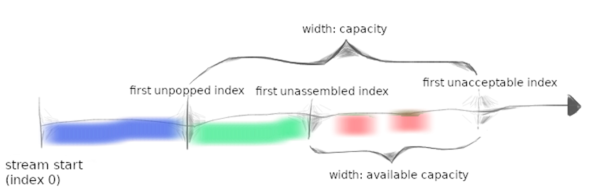

## 总览

介绍了 TCP 是**可靠的有序字节流**，简单介绍了它的地位。以下的 assignments 会基于不可靠的 datagram 来实现可靠的 TCP 协议。在未来的 labs，需要两个 lab 0 中的 ByteStream，一个用于发送数据，一个用于接收数据。

## 开始

依然是使用 Minnow 库：

1. 确保提交了 checkpoint 0 的代码，不要更改 `src` 之外的文件，以及 `webget.cc`。
2. `git fetch` 来获取最新的 lab assignments
3. `git merge name-of-cs144-origin/check1-startercode` 来下载 checkpoint 1 的初始代码
4. 确保 build 路径正确设置
5. 编译 `cmake --build build`
6. 打开并且编辑 `writeups/check1.md`

## 按顺序恢复子串

TCP receiver：接收 datagrams，并将其按顺序排列、丢弃重复的、重新请求发送丢失的。

TCP sender：将大的数据流分成小的数据片（1460字节每片）。

实现：`Reassembler`，接收子串。

1. 子串包含字符串、以及其第一个字节的索引 within the larget stream. 
2. **每个字节**都有独立的索引，从 0 开始。
3. Reassembler 获取流的 **下一个字节** 后，就会把它写到输入端的 `ByteStream`
4. customer 可以从其中读取内容。

实现所有 `reassembler.hh` 中的 public 接口，不允许自己修改 public 接口。

### Reassembler 内部应该存储什么？

`insert` 通知 Reassembler 有新的字节流分片，以及其大小（字符串开头的索引）

需要解决三个问题：

1. Bytes 是流中的 *next bytes*，直接写入。
2. Bytes 小于 stream 的可用容量范围内，但目前并不能写入，因为之前的 bytes 未知。**暂存**。
3. Bytes 超过了 stream 的可用容量范围。**丢弃**。Reassembler 不会存储任何不能被立刻写入的字节（包括太大、或者需要等待较早的字节已知的内容）

宗旨是 **节省内存容量**。到达的不管是什么数据，我们都用以下的图来描述：



- 红色：Reassembler 内部存储的字节
- 绿色：ByteStream 存储的字节
- 蓝色：已经被 popped 的字节

---

### FAQs

- 整个流的第一个字节的索引是什么？**0**.

- 我的实现的性能应该是？

  **选择的数据结构非常重要。不要选择耗时的数据结构或者占据大量空间的结构，Reassembler 会是你的 TCP 实现的基础。你有很多选择。我们已经准备了 benchmark，任何大于 0.1 Gbps 的都可以通过。最大可以实现 10 Gbps 的 Reassembler。**

- 如何处理不连续的子串？

  **你可以假设他们并不存在。就是说，你可以假设存在唯一的底层字节流，所有的子字符串都是其准确的切片。**

- 我可能用到？

  **你可以使用任何标准库组件。特别地，我们希望你至少使用一种数据结构。**

- 什么时候将 bytes 写入流？

  **尽可能快。唯一不能写入的情况就是字节流的前一个字节还没准备好。**

- 子串可能会重复吗？ **是的**。

- 我可以向 Reassembler 添加 private 成员函数吗？

  **当然。子串可能以任何顺序到达，所以你的数据结构需要记住子串的顺序，直到他们被 push 进入 Stream，即在该子串的前面所有字节都写入完成。**

- 我们的 re-assembly 结构可以存储重复子串吗？

  **不可以。即使你可以正确的实现，但是这样会打破节约内存的规则。**

- Reassembler 会使用 ByteStream 的读端吗？

  **不会。这是外部消费者做的。Reassembler 仅使用写端。**

- 你们预期的实现是多少？

  **运行 ./scripts/lines-of-code 会打印你的代码行数。我们希望 Reassembler 在 50 - 60行左右（starter code 的基础上）**

- 更多 FAQs：https://cs144.github.io/lab_faq.html

> 经过几个小时的折磨，终于弄清楚了 `insert` 的逻辑。
>
> `bytes_pending()` 很简单，记录一下 pending 长度就行，主要的问题在于 `insert()` 的情况比较复杂。
>
> 按照 `first_index` 参数来区分情况，首先先去重，也就是 `first_index < next_index_` 的情况，把重复的内容去掉。
>
> 去重后记得更新 `first_index`。
>
> 什么时候会写入呢？自己维护一个 `next_index`，然后 `first_index == next_index` 时就写入。
>
> 要注意容量吗？并不用，p0 我们实现的 byte stream 已经处理了。
>
> 此外，`next_index` 大概对应上图的 `first unassembled index`，而 `first_index` 是每个子串的 index。注意看图中红色的部分是断开的，那我们自然也不能用 `std::vector<char>` 来存储这些 bytes。我认为用 `std::map<uint64_t, std::string>` 存就可以，这样少一些复制。
>
> 
>
> 什么时候会保存在 Reassembler 中呢？**写入操作不需要保存，不会出现写一半存一半的情况。**只有前面的内容没收到时才保存。
>
> 保存非常麻烦，要考虑容量问题。
>
> 容量足够的话就不说了，直接存入；
>
> 容量不够的话，要截断，怎么截断？
>
> **容量，指的是 output stream 的容量，上面的图里画了。** 截断时要留下 `first_index - next_index` 空间，这样才能够前文写入。
>
> 我的做法是，先在 map 中查找有没有 `first_index` 的存在，有的话，比较两个字符串的大小，留下长的。
>
> 之后就是遍历所有的结点，去掉重复的内容，怎么去除呢？
>
> 插入字符串的 `first_index ~ final_index` 期间的所有 map 结点都 erase 就好。
>
> 然后遍历所有的结点，把前一个结点和后一个结点重复的部分去除就行。
>
> 但是要注意插入的字符串已经是某个 pending 字符串子串的情况。这种情况直接返回。
>
> 
>
> 记得要把 pending 的字符串写入，不会出现容量不够的情况，上面已经说了容量的计算了。然后把 `first_index <= next_index_` 的内容全部写入，直接调用现有函数就行。
>
> 
>
> 最后关于 `close` 写端，需要在写入所有的字节后关闭，但可能字节为 0，所以我用了个 `std::optional` 来记录，如果没有确定 last index，那么就是空，否则就不为空，之后判断就行。
>
> 
>
> 这种解法已经是我能想到最快的了，跟字符串有关的操作全部都是 `O(1)`，没有复制开销，全部是移动，然后要遍历所有的结点。

## 开发和 Debug 建议

1. 你可以通过 `cmake --build build --target check1` 来测试代码（编译之后）

   > 我寻思 `cmake --build` 不应该已经编译了吗，不过我好像也没怎么用过 cmake 的指令...

2. 重新读一次 `Lab 0 ` 的 using git 部分，确保代码最新。

3. 说了一堆，意思就是让你代码内容明确，然后写点注释

4. 保证 Modern C++

5. 如果你编译卡住了又没法修复，你可以删除 `build` 目录，然后根目录下 `cmake -S . -B build`

## 提交

1. 保证仅修改 `/src` 下的 `.hh` `.cc` 文件，不要修改 `public` 接口。

2. 在你写作业之前，请按顺序运行：

   1. 确保已经 commit 了所有的修改，可以用 `git status` 查看。

   2. `cmake --build build --target format`

      > VSCode + clang-format 大法好

   3. `cmake --build build --target check1`（确保所有测试通过）

   4. 可选：`cmake --build build --target tidy` （改进代码）

3. 编写报告 `check1.md`，一行控制在 80 个字符以内，最好 20~50，这样容易读。

   > 太长了我又不写这个，不翻译。

4. 注意填写你做了几个小时，以及其他的评论

5. The mechanics of “how to turn it in” will be announced before the deadline. 
6. Please let the course staff know ASAP of any problems at the lab session, or by posting a question on Ed. Good luck

## 源代码

```cpp
#pragma once

#include "byte_stream.hh"
#include <map>
#include <optional>
class Reassembler
{
public:
  // Construct Reassembler to write into given ByteStream.
  explicit Reassembler( ByteStream&& output ) : output_( std::move( output ) ) {}

  /*
   * Insert a new substring to be reassembled into a ByteStream.
   *   `first_index`: the index of the first byte of the substring
   *   `data`: the substring itself
   *   `is_last_substring`: this substring represents the end of the stream
   *   `output`: a mutable reference to the Writer
   *
   * The Reassembler's job is to reassemble the indexed substrings (possibly out-of-order
   * and possibly overlapping) back into the original ByteStream. As soon as the Reassembler
   * learns the next byte in the stream, it should write it to the output.
   *
   * If the Reassembler learns about bytes that fit within the stream's available capacity
   * but can't yet be written (because earlier bytes remain unknown), it should store them
   * internally until the gaps are filled in.
   *
   * The Reassembler should discard any bytes that lie beyond the stream's available capacity
   * (i.e., bytes that couldn't be written even if earlier gaps get filled in).
   *
   * The Reassembler should close the stream after writing the last byte.
   */
  void insert( uint64_t first_index, std::string data, bool is_last_substring );

  // How many bytes are stored in the Reassembler itself?
  uint64_t bytes_pending() const;

  // Access output stream reader
  Reader& reader() { return output_.reader(); }
  const Reader& reader() const { return output_.reader(); }

  // Access output stream writer, but const-only (can't write from outside)
  const Writer& writer() const { return output_.writer(); }

private:
  void insert_or_store( uint64_t first_index, std::string data );

  void write_stored_str();

  void write( std::string data );

  void store( uint64_t first_index, std::string data );

  uint64_t truncate_head( uint64_t old_index, std::string& data );

private:
  ByteStream output_; // the Reassembler writes to this ByteStream

  std::map<uint64_t, std::string> pending_substr_ {};

  uint64_t bytes_pending_ {};

  uint64_t next_index_ {};

  std::optional<uint64_t> total_pushed_len_ { std::nullopt };
};
```

```cpp
#include "reassembler.hh"
#include <iostream>
#include <utility>
#include <vector>

using namespace std;

void Reassembler::insert( uint64_t first_index, string data, bool is_last_substring )
{
  if ( is_last_substring ) [[unlikely]] {
    total_pushed_len_ = first_index + data.length();
  }
  insert_or_store( first_index, std::move( data ) );
  write_stored_str();
  if ( total_pushed_len_.has_value() && output_.writer().bytes_pushed() == *total_pushed_len_ ) [[unlikely]] {
    output_.writer().close();
  }
}

void Reassembler::insert_or_store( uint64_t first_index, std::string data )
{
  if ( first_index < next_index_ ) {
    first_index = truncate_head( first_index, data );
  }
  if ( first_index > next_index_ ) {
    store( first_index, std::move( data ) );
  } else {
    write( std::move( data ) );
  }
}

void Reassembler::write_stored_str()
{
  for ( auto& [first_index, data] : pending_substr_ ) {
    if ( first_index <= next_index_ ) {
      auto buf = std::exchange( data, "" );
      bytes_pending_ -= buf.length();
      insert_or_store( first_index, std::move( buf ) );
    }
  }
  std::erase_if( pending_substr_, []( const auto& elem ) { return elem.second.empty(); } );
}

void Reassembler::write( std::string data )
{
  output_.writer().push( std::move( data ) );
  next_index_ = output_.writer().bytes_pushed();
}

void Reassembler::store( uint64_t first_index, std::string data )
{
  if ( auto len = output_.writer().available_capacity() - ( first_index - next_index_ ); data.length() >= len ) {
    data.erase( data.begin() + len, data.end() );
  }
  if ( data.empty() ) [[unlikely]] {
    return;
  }
  if ( pending_substr_.empty() ) [[unlikely]] {
    bytes_pending_ += data.length();
    pending_substr_.emplace( first_index, std::move( data ) );
  } else {
    auto final_index = first_index + data.length() - 1;

    if ( pending_substr_.contains( first_index ) ) {
      if ( pending_substr_[first_index].length() >= data.length() ) {
        return;
      }
      auto mapped_data = std::exchange( pending_substr_[first_index], "" );
      bytes_pending_ -= mapped_data.length();
      pending_substr_.erase( first_index );
    }

    std::erase_if( pending_substr_, [&]( const auto& node ) {
      if ( node.first >= first_index && node.first + node.second.length() - 1 <= final_index ) {
        bytes_pending_ -= node.second.length();
        return true;
      }
      return false;
    } );

    for ( const auto& [idx, str] : pending_substr_ ) {
      if ( first_index >= idx && final_index <= idx + str.length() - 1 ) {
        return;
      }
    }

    bytes_pending_ += data.length();
    pending_substr_.emplace( first_index, std::move( data ) );

    auto begin_node = pending_substr_.lower_bound( first_index );
    auto end_node = pending_substr_.upper_bound( final_index );
    if ( begin_node != std::begin( pending_substr_ ) ) {
      begin_node = std::prev( begin_node );
    }
    for ( auto node = begin_node; std::next( node ) != end_node; ++node ) {
      auto next_node = std::next( node );
      auto this_final_index = node->first + node->second.length() - 1;
      auto next_first_index = next_node->first;
      if ( this_final_index >= next_first_index ) [[likely]] {
        auto len = this_final_index - next_first_index + 1;
        bytes_pending_ -= len;
        node->second.erase( node->second.begin() + node->second.length() - len, node->second.end() );
      }
    }
  }
}

uint64_t Reassembler::truncate_head( uint64_t old_index, std::string& data )
{
  data.erase( 0, next_index_ - old_index );
  return next_index_;
}

uint64_t Reassembler::bytes_pending() const
{
  return bytes_pending_;
}
```

