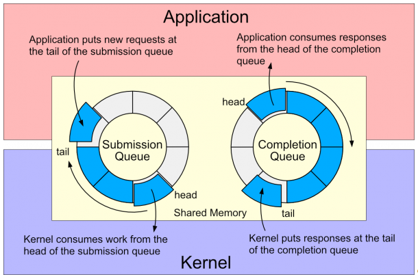

本文是文章 [Why you should use io_uring for network I/O](https://developers.redhat.com/articles/2023/04/12/why-you-should-use-iouring-network-io) 的翻译。

一起来从头认识 linux 最新的 io_uring


`io_uring` 是 linux 的异步 I/O 接口，对网络编程可能很有用。对于文件 IO 来说十分好用，但对于网络 IO 可能只能享受到一小部分收益，因为已经有非阻塞 I/O 的 API了。收益可能是因为：

- 在上下文切换频繁的服务器中，减少系统调用次数
- 对文件和网络 I/O 提供统一 API

io_uring 需要比较新的 linux 版本。

## io_uring 是什么

`io_uring` 是 linux 内核的异步 IO 接口，io_uring 是位于共享内存中的一对环形缓冲区，其是一对环形的介于内核和用户之间的队列。

- Submission Queue (SQ): 用户进程使用 SQ 来向内核发送异步 I/O 请求。
- Completion Queue (CQ): 内核会将异步 IO 的结果通过 CQ 来返回给用户。



这个接口允许应用程序从传统的 readiness-based IO 模型变成新的 completion-based 模型，文件和网络IO共享统一的 API。

## 系统调用 API

linux 内核为 io_uring 提供了 3 个 syscall api：

- `io_uring_setup` : 准备一个 context 来执行异步 IO
- `io_uring_register` : 注册异步 IO 的文件或者用户 buffer 

- `io_uring_enter`: 调用 and/or 完成异步 IO

前两个 syscall 用于创建 io_uring 实例，并选择是否让 io_uring 使用提前准备好的 buffer 来执行操作。只有 `io_uring_enter` 需要在提交和消费队列时被调用。`io_uring_enter` 的开销可以通过许多 IO 操作摊销。对于很繁忙的服务器，你可以通过开启 SQ 的 busy-polling 来避免多次调用 `io_uring_enter` ，代价是内核线程消耗 CPU。

## liburing

liburing 提供了一个方便的使用 io_uring 的方式，隐藏了复杂的细节并且提供了函数来准备所有类型 IO 操作的 submission。

用户进程创建 io_uring:

```cpp
struct io_uring ring;
io_uring_queue_init(QUEUE_DEPTH, &ring, 0);
```

之后向 SQ 提交操作：

```cpp
struct io_uring_sqe *sqe = io_uring_get_sqe(&ring);
io_uring_prep_readv(sqe, client_socket, iov, 1, 0);
io_uring_sqe_set_data(sqe, user_data);
io_uring_submit(&ring);
```

进程等待 completion：

```cpp
struct io_uring_cqe *cqe;
int ret = io_uring_wait_cqe(&ring, &cqe);
```

使用返回内容：

```cpp
user_data = io_uring_cqe_get_data(cqe);
if (cqe->res < 0) {
    // handle error;
} else {
    // response
}
io_uring_cqe_seen(&ring, cqe);
```

优先推荐通过使用 liburing API 来使用 io_uring，liburing 拥有 io_uring 最新版本的所有特性，并且兼容老版本的 kernel。

## 使用 io_uring 进行网络 I/O

我们通过编写一个简单的 echo server 来尝试使用 io_uring。然后我们就可以看到如何最少化系统调用来完成高并发。

### 简单的 echo server

经典的例子会像：

```cpp
client_fd = accept(listen_fd, &client_addr, &client_addr_len);
for (;;) {
    numRead = read(client_fd, buf, BUF_SIZE);
    if (numRead <= 0) 
        break;
    if (write(client_fd, buf, numRead) != numRead) {
        // handle error
    }
}
close(client_fd);
```

服务器必须使用多线程或者使用非阻塞 I/O 来支持并发请求，不管他什么形式，每有一个客户端服务器都必须至少 5 个系统调用，accept, read, write, read 检测 EOF，close

使用 io_uring 的版本的异步服务器一次提交一个操作请求并且在下次提交时等待 completion。io_uring 版本的服务器伪代码大概如下（省略样板和错误处理）：

```cpp
add_accept_request(listen_socket, &client_addr, &client_addr_len);
io_uring_submit(&ring);

while (1) {
    int ret = io_uring_wait_cqe(&ring, &cqe);
    struct reqeust *req = (struct reqeust*) cqe->user_data;
    switch(req->type) {
        case ACCEPT:
            add_accept_request(listen_socket, &client_addr, &client_addr_len);
            add_read_request(cqe->res);
            io_uring_submit(&ring);
            break;
        case READ:
            if (cqe->res <= 0) {
                add_close_request(req);
            } else {
                add_write_request(req);
            }
            io_uring_submit(&ring);
            break;
        case WRITE:
            add_read_request(req->socket);
            io_uring_submit(&ring);
            break;
        case CLOSE:
            free_request(req);
            break;
    	DEFAULT:
            fprintf(stderr, "Unexpected req type %d\n", req->type);
            break;
    }
    
    io_uring_cqe_seen(&ring, cqe);
}
```

在这个 io_uring 的示例中，服务器需要至少 4 个系统调用。唯一省略的是通过一次性提交 read 和新 accept 请求。可以通过以下的 strace 输出来查看服务器收到 1000 个客户端请求：

```cpp
% time     seconds  usecs/call     calls    errors syscall
------ ----------- ----------- --------- --------- ----------------
 99.99    0.445109         111      4001           io_uring_enter
  0.01    0.000063          63         1           brk
------ ----------- ----------- --------- --------- ----------------
100.00    0.445172         111      4002           total
```

### 组合提交

在 echo 服务器中，因为我们必须在写之前完成读所以限制了我们串联 IO 操作的机会。我们可以链接 accept 和 read，通过使用 io_uring 的 fixed file 特性，但我们已经一次性一起提交了 read 请求和 new accept 请求，所以可能不会有多少收益。

我们可以在同一时间提交互相不依赖的操作，所以我们可以 *combine* 写之后读的提交。这会将 syscall 减少到 3次。

```cpp
% time     seconds  usecs/call     calls    errors syscall
------ ----------- ----------- --------- --------- ----------------
 99.93    0.438697         146      3001           io_uring_enter
  0.07    0.000325         325         1           brk
------ ----------- ----------- --------- --------- ----------------
100.00    0.439022         146      3002           total
```

### Draning the completion queue

如果我们在调用 io_uring_submit 前解决了所有已经进入队列的 completions，那么就可以一次性一起提交更多的操作。我们可以通过使用 `io_uring_wait_cqe` 来等待 work，之后调用 `io_uring_peek_cqe` 来检查是否 completion queue 还有空间容纳未被处理的操作。这避免了忙循环中 completion queue 为空时的自旋等待，并且会尽快消耗 completion queue。

主循环的伪代码类似于：

```cpp
while (1) {
    int submissions = 0;
    int ret = io_uring_wait_cqe(&ring, &cqe);
    while (1) {
        struct request *req = (struct request *) cqe->user_data;
        switch (req->type) {
        case ACCEPT:
            add_accept_request(listen_socket,
                              &client_addr, &client_addr_len);
            add_read_request(cqe->res);
            submissions += 2;
            break;
        case READ:
            if (cqe->res <= 0) {
                add_close_request(req);
                submissions += 1;
            } else {
                add_write_request(req);
                add_read_request(req->socket);
                submissions += 2;
            }
            break;
        case WRITE:
          break;
        case CLOSE:
            free_request(req);
            break;
        default:
            fprintf(stderr, "Unexpected req type %d\n", req->type);
            break;
        }

        io_uring_cqe_seen(&ring, cqe);

        if (io_uring_sq_space_left(&ring) < MAX_SQE_PER_LOOP) {
            break;     // the submission queue is full
        }

        ret = io_uring_peek_cqe(&ring, &cqe);
        if (ret == -EAGAIN) {
            break;     // no remaining work in completion queue
        }
    }
    if (submissions > 0) {
        io_uring_submit(&ring);
    }
}
```

这样即可有极大的提升：

```cpp
% time     seconds  usecs/call     calls    errors syscall
------ ----------- ----------- --------- --------- ----------------
 99.91    0.324226        4104        79           io_uring_enter
  0.09    0.000286         286         1           brk
------ ----------- ----------- --------- --------- ----------------
100.00    0.324512        4056        80           total
```

提升显著，一次 syscall 可以处理多于 12 个的客户端请求，或者每次 syscall 平均多余 60次 IO ops。随着服务器越来越忙，比率也会提高，可以通过日志证明：

```cpp
% time     seconds  usecs/call     calls    errors syscall
------ ----------- ----------- --------- --------- ----------------
 68.86    0.225228          42      5308       286 write
 31.13    0.101831        4427        23           io_uring_enter
  0.00    0.000009           9         1           brk
------ ----------- ----------- --------- --------- ----------------
100.00    0.327068          61      5332       286 total
```

这表明当服务器有更多工作要做时， io_uring 操作有更多时间完成，所以一次 syscall 可以提交的 work 更多。echo server 可以通过仅仅 23 个 syscall 就完成 1000个 echo 请求或者 5000 个 socket I/O.

需要注意的是，随着提交 work 数量的增加，io_uring_enter 的调用时间消耗也会增加，到某个节点时可能需要限制提交的批处理大小或者开启内核的 submission queue polling。

## 网络 I/O 的收益

io_uring  对于网络 IO 的效果则是更现代更容易使用的异步 API 以及统一的文件与网络 IO 语义。

潜在的收益是减少 syscall 次数，这可以在小的syscall操作占比高以及频繁切换上下文的场景下获得比较高的收益。

可以通过在发送 io_uring 请求前向内核预先注册资源来避免在服务器上基类昂贵的操作。可以注册 file slots 和 buffers 来避免每次 IO 操作的查找和引用计数成本。

注册 file slots，称为 **fixed files**，也可以实现在 read 和 write 中链接 accept，而不用再在用户态绕一圈。submission queue entry（SQE）需要指定 fixed file slot 来存储之后 SQE 需要在 IO 中引用的 accept 的返回值。

## 限制

理论上，操作可以通过使用 `IOSQE_IO_LINK` 标记来链在一起。然而对于读写，没有机制可以强制读操作的返回值作为参数输入到写操作中。这限制了某些语义顺序，例如：写后读，写后关闭，以及 accept 后的读或写。

另外一个需要考虑的是 io_uring 是仍在开发中的 linux kernel 特性，某些特性可能以后会优化。

io_uring 现在是 Linux 限定 API，所以将他移植进例如 libuv 这种库中很难。

## 最新特性

io_uring 的最新特性是 multi-shot accept, 5.19 后的内核支持，以及 multi-shot receive，6.0后的内核支持。multi-shot accept 允许一个应用程序发出单个 accept SQE，当内核收到新的请求时会一直post CQE。Multi-shot 也会在每次新数据可用时post CQE。

## 结论

io_uring API 是一个函数式异步 IO API，为文件和网络 IO 提供统一的接口。他有潜力成为更好的网络 IO 的基础，并为混合网络和文件 IO 的应用程序提供更大优势。

著名的异步 IO 库，例如 libuv 是多平台的，适配 Linux 特供 API 比较困难，当一个库中加入 io_uring，不管是文件 IO 还是网络 IO ，都会从 io_uring 的异步 completion 模型中获得收益。

网络相关 IO 开发和优化会持续进行。现在是时候使用 io_uring 了。

## 其他推荐资料

[原生的 Linux 异步文件操作，io_uring 尝鲜体验](https://segmentfault.com/a/1190000019300089)

[Welcome to Lord of the io_uring — Lord of the io_uring documentation (unixism.net)](https://unixism.net/loti/index.html)
