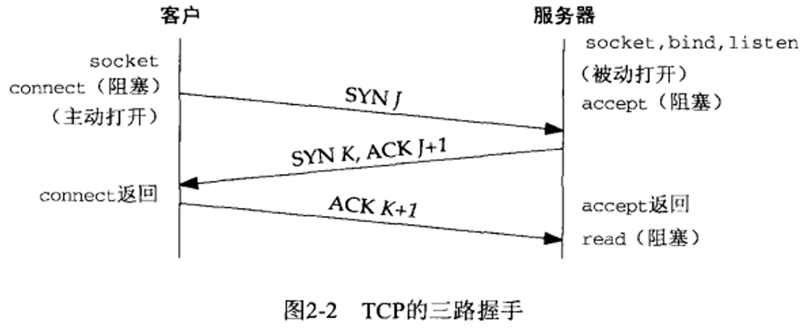
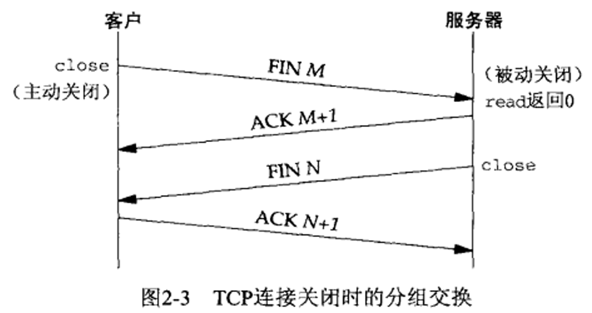
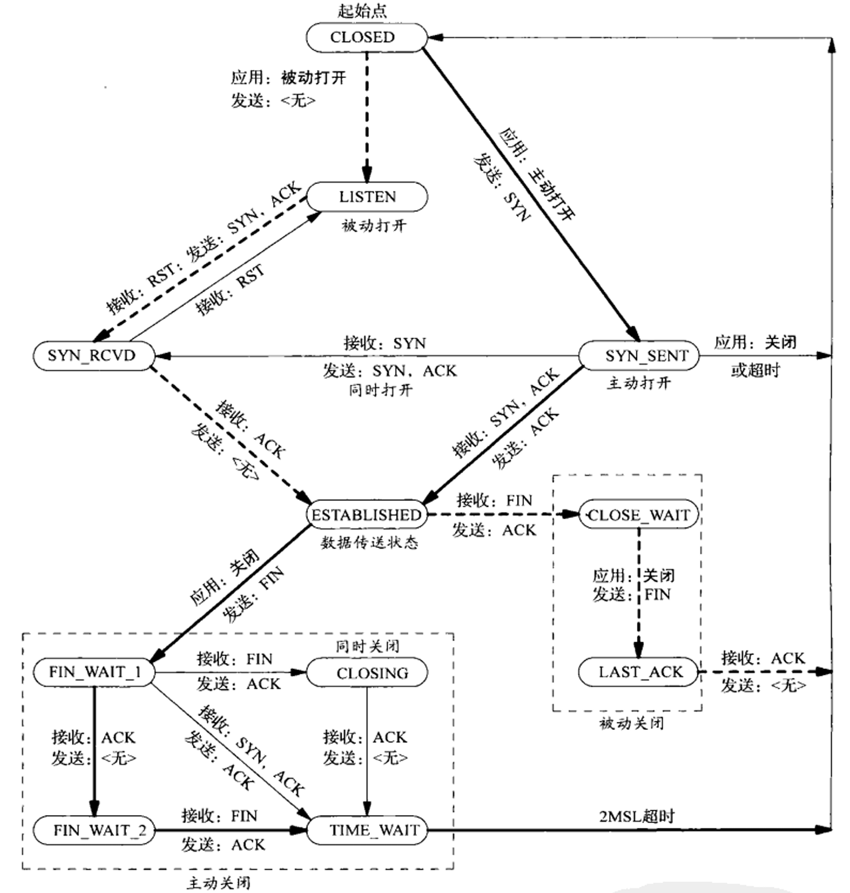
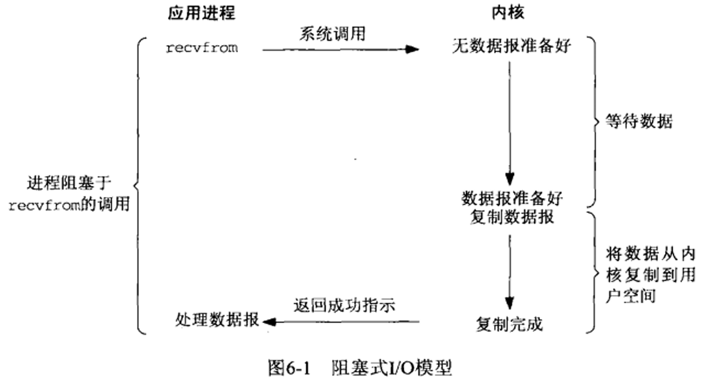
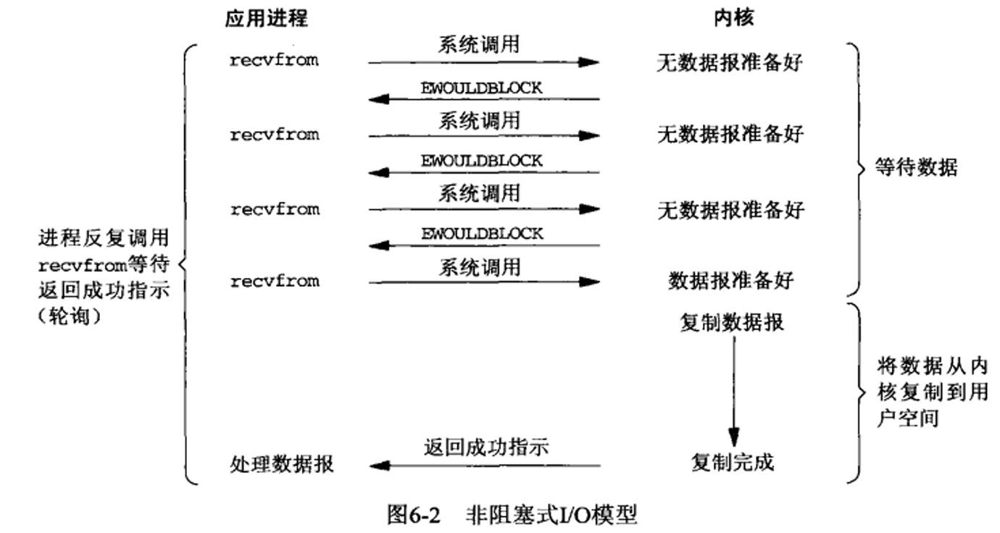
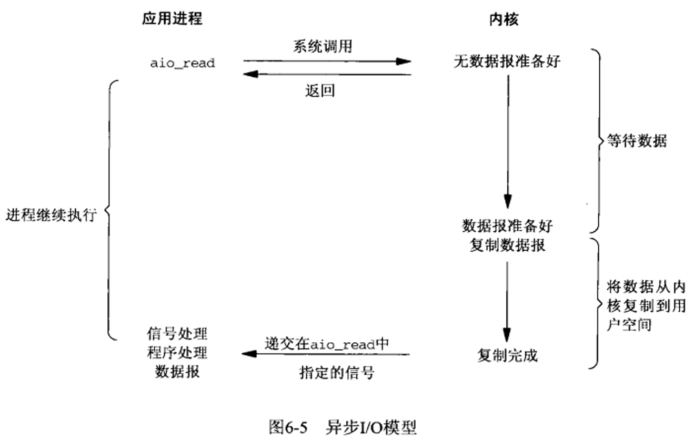
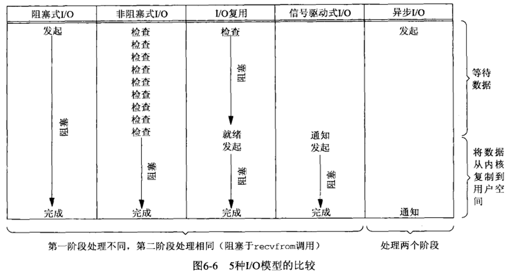
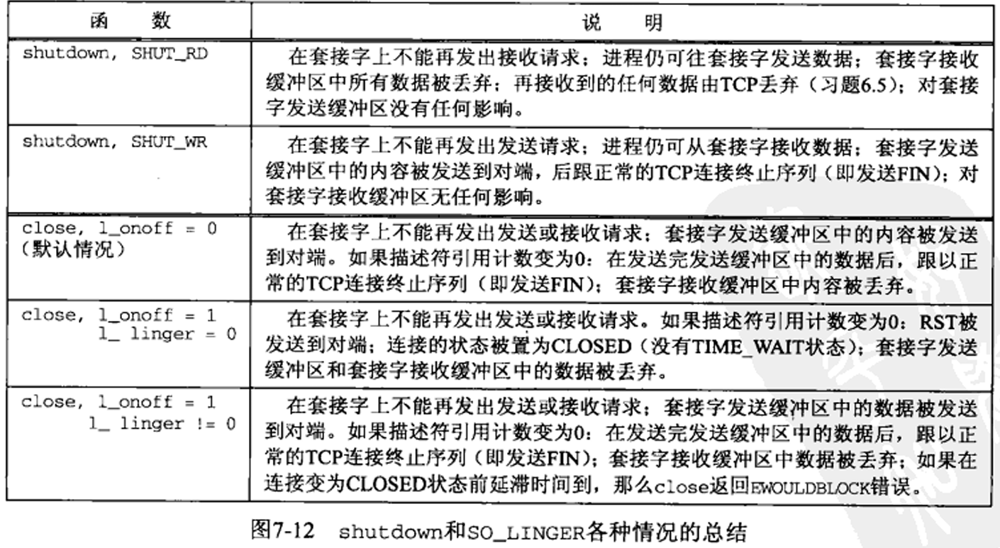
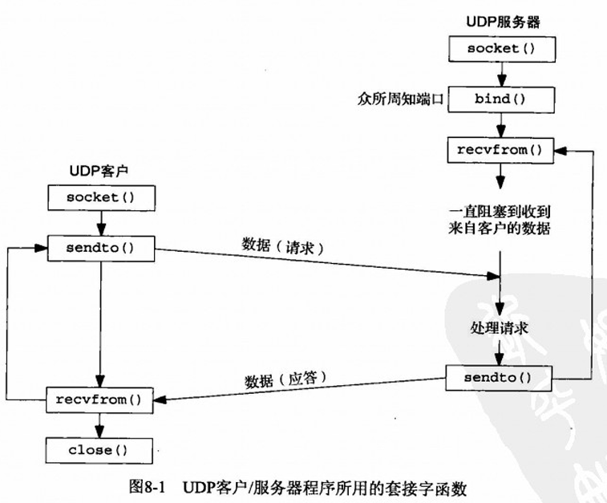

## 前言

记录一下老三样的使用方法，以及网络编程的疑难杂症。主要来自于 UNP。

顺便，初始化 socket 就不重复写了。

再者，文章中 EWOULDBLOCK 和 EAGAIN 在一般的实现中值是相同的。

## 协议以及基础介绍

### 主要协议

- IPv4: 32位 ip 地址，提供分组递送服务
- IPv6: 128位 ip 地址
- TCP：面向**连接**，提供全双工字节流，**流套接字**，关心确认、超时、重传等细节，支持IPv4, IPv6
- UDP：**无连接**，**数据包套接字**，不保证到达目的地。支持IPv4, IPv6
- ARP：**地址解析协议**。把 IPv4 地址映射成硬件地址，通常用于以太网。在 P2P 网络中不重要。
- RARP：把硬件地址映射成 IPv4.

### UDP 用户数据报协议

应用程序往 UDP socket 写入数据，封装为一个 UDP 数据报，又被封装为 IP 数据报，然后发送。**不保证到达顺序，不保证是否到达，不保证数据报只到达一次。**

**UDP 数据报有一个长度，而 TCP 没有。**

说 UDP 无连接是说 UDP 客户和服务器不必存在任何长期关系。比如 UDP 客户端可以用同一个套接字给不同服务器发送消息。

### TCP 传输控制协议

TCP 提供客户与服务器的连接，**TCP 客户先与某个给定服务器建立一个连接，再跨连接与那个服务器交换数据，然后终止连接**。

TCP 比较可靠，要求对端确认数据，如果没有收到确认就会**自动重传**并等待。数次失败后 会放弃。

TCP 会估算客户和服务器之间的**往返时间**，以便知道需要等多久。

TCP 会给其中每个小节关联一个序列号对发送数据进行**排序**。如果收到重复数据，会丢弃。

TCP 提供**流量控制**，告知对方现在自己能接收多少数据。

最后，**TCP 全双工**，意味着在一个连接上的引用可以在两个方向上既接受又发送数据。当然可以把它转化为单工连接。

### TCP 连接建立与终止

### 三次握手

TCP 连接过程：

1. 服务器通过 socket, bind, listen 三个函数准备好接受连接
2. 客户端通过 connect 发起连接。此时客户 TCP 发送 SYN
3. 服务器发送 ACK，SYN
4. 客户端确认服务器的 SYN，回复 ACK



客户端 SYN 初始为 J，服务器端 SYN 初始为 K，期待的 ACK 都是对应的 SYN + 1.

### TCP 连接终止

1. 某个应用调用 `close()` ，**主动关闭**，发送 FIN
2. 收到 FIN 的一方执行**被动关闭**，需要确认，然后把他的接收作为一个 EOF 传递给接收端应用
3. 一段时间后，接收 EOF 的进程调用 `close()` 关闭 socket，也发送一个 FIn
4. 接收这个最终 FIn 的原发送端（主动关闭那一方）确认这个 FIN

某些情况下，步骤1 的 FIN 跟数据一起发送；步骤 2，3 都是出自被动关闭那一方，可能一起发送；



### TCP 状态图



实现箭头：客户的正常状态转换

虚线箭头：服务器的正常状态转换

应用：状态转换在应用进程发起操作时发生

接收：表示接收分节时发生

发送：表示转换发送什么

### 输出缓冲区

**每个 TCP socket 都有一个发送缓冲区，调用 `write` 内核会从应用程序的缓冲区中复制数据到套接字的发送缓冲区**。如果 socket 为阻塞使用，且缓冲区已经满或者有其他数据或者进程缓冲区更大，那么程序都会挂起。

**`write` 返回时是内核已经把数据复制到发送缓冲区，仅代表可以使用教程的缓冲区了。**

UDP 套接字没有缓冲区，内核没必要保存数据，因为 UDP 不可靠。但是有一个发送缓冲区大小，如果发送数据太大会返回 EMSGSIZE 错误。应用进程的数据在传递时，通常会保存到某种格式的内核缓冲区，发送完就会被丢弃。而 TCP 因为要确认，所以会暂时保留。

`write` 返回就表示数据报或者其所有片段都加入了数据链路层的输出队列，如果队列没有足够的空间，通常会返回 ENOBUFS（也许有的实现并不返回）

## 阻塞与非阻塞 IO

### 不同的 IO 概念图









异步是让内核帮我们完成收取数据，复制到应用，完成后通知我们，而 IO 多路复用则是阻塞在 select 和 poll 这两个函数上。

### 网络编程

网络编程无非就几个事件，

- 连接：服务器为 accept，客户端 connect
- 读： read/readv/recv/recvfrom/recvmsg
- 写： write, 
- 断开连接

对于输入（读）操作，

1. 在**阻塞**情况下，TCP 若 socket 的接收缓冲区中没有数据，则休眠；如果有数据，就立马读；
2. 在**非阻塞**情况下，TCP 若没有至少一个字节可以读，则会立马返回 EWOULDBLOCK

对于输出（写）操作，

1. 在**阻塞**情况下，若发送缓冲区没有空间，将阻塞，直到有空间为止
2. 在**非阻塞**情况下，如果缓冲区没有空间，会立即返回 EWOULDBLOCK；如果**有一些空间，会返回的是能够复制到该缓冲区中的字节数。**

接受连接，即 accept：

1. 在**阻塞**情况下，会阻塞到直到有新的连接到达。
2. 在**非阻塞**情况下，会立即返回 EWOULDBLOCK

发起连接，connect：

1. 在**阻塞**情况下，会等待三次握手后连接建立
2. 在**非阻塞**情况下，会发起三次握手，然后直接返回 EINPROGRESS（在服务器和主机是同一个服务器的情况，可能会成功返回，所以非阻塞也得考虑成功的情况）


## 套接字选项

```cpp
int setsockopt(int fd, int level, int optname, const void* optval, socklen_t optlen);
```

- level 是指定系统重解释选项的代码 或者为 通用套接字代码 或者为某个特定协议
- optval 用于读取待设置的新值（一般是1代表启用）

### SO_KEEPALIVE

2个小时没有数据流动，就会自动发送一个**保持存活探测分节**：

1. 对端以期望的 ACK 响应。一切正常。
2. 对端以 RST 响应，告知本端 TCP：对端崩溃且已经重启，该套接字本身会被关闭
3. 对端没有响应，会继续探测，持续一段时间后如果还没有响应就会放弃。

当然，你也可以在应用层手动设置心跳（heartbeat）机制来确认。

### SO_LINGER

指定 close 函数面对面向连接协议的操作。默认 close 会立刻返回，**但如果有数据残留在发送缓冲区，那么会试着把数据发出去**。

这时需要处理 close 的返回值。



### SO_REUSEADDR 和 SO_REUSEPORT

必须开启，防止因为服务器重启而不能绑定。

### SO_REVTIMEO

本选项一旦设置到某个描述符，超时设置会应用于该描述符上的所有**读**操作。

### SO_SNDTIMEO

本选项一旦设置到某个描述符，超时设置会应用于该描述符上的所有**写**操作。

## close()/shutdown()

1. `close` 会把 fd 的引用计数 -1，仅在计数为 0 才关闭 socket，此外，会直接关闭读写两个方向的数据传输。
2. 使用 shutdown 可以不管引用计数直接激发 TCP 的正常连接终止，可以选择半关闭套接字。

**我们需要考虑到，关闭 socket 时可能还会有数据在路上，没收到。**

## select

```cpp
#include <sys/select.h>
#include <unistd.h>

#include <array>
#include <iostream>

#include "util.hpp"

int main(int argc, char* argv[]) {
    if (argc != 2) {
        std::cerr << "Usage: ./select port\n";
        return -1;
    }

    int sockfd = socket_init(atoi(argv[1]));
    std::cout << "Listen: " << sockfd << '\n';

    // select 可以监视上述读事件和写事件

    // 监视的 socket 集合，1024 bit 的 bitmap (int[32])
    // 操作位图的宏：
    // void FD_CLR(int fd, fd_set* set)
    // int FD_ISSET(int fd, fd_set* set)
    // void FD_SET(int fd, fd_set* set)
    // void FD_ZERO(fd_set* set)
    fd_set fds;
    FD_ZERO(&fds);
    FD_SET(sockfd, &fds);

    int max_fd = sockfd;

    for (;;) {
        timeval timeout{ .tv_sec = 10, .tv_usec = 0 };
        // 先拷贝一份 bitmap，因为会被修改
        fd_set tmpfds = fds;

        // select
        // p1: bitmap size (max + 1)
        // p2: 监视读事件的 bitmap
        // p3: 监视写事件的 bitmap，如果监视写事件，那么发送缓冲区没满就会一直通知
        // p4: 监视异常事件的 bitmap
        int nfds = select(max_fd + 1, &tmpfds, nullptr, nullptr, nullptr);

        if (nfds < 0) {
            std::cerr << "select() failed\n";
        }
        if (nfds == 0) {
            std::cerr << "select() timeout\n";
        }

        // if > 0
        for (int eventfd{}; eventfd <= max_fd; ++eventfd) {
            if (FD_ISSET(eventfd, &tmpfds) == 0)
                continue;

            //  发生事件的是 linsten socket，那么说明有新的客户端连接
            if (eventfd == sockfd) {
                sockaddr_in client;
                socklen_t len = sizeof(sockaddr_in);
                int client_sock = accept(sockfd, (sockaddr*)&client, &len);

                if (client_sock < 0) {
                    std::cerr << "accept() failed\n";
                    continue;
                }

                std::cout << "accept client. socket = " << client_sock << '\n';

                // 把新连接的 socket 也要进行监听
                FD_SET(client_sock, &fds);

                max_fd = std::max(max_fd, client_sock);
            } else {
                // 如果是客户端的 socket 发生事件，
                // 那么 1. 说明是接收到了数据; 2. 客户端断开连接
                std::array<char, 1024> buf{};

                // 客户端断开连接
                if (read(eventfd, buf.data(), buf.size()) <= 0) {
                    std::cout << "Disconnected. socket = " << eventfd << '\n';
                    close(eventfd);
                    FD_CLR(eventfd, &fds);

                    // 恰好是最后一个客户端，那么就要重新计算 max_fd
                    if (eventfd == max_fd) {
                        for (int i = max_fd; i > 0; --i) {
                            if (FD_ISSET(i, &fds)) {
                                max_fd = i;
                                break;
                            }
                        }
                    }
                } else {
                    // 如果客户端有数据发送
                    std::cout << "client: " << eventfd << "\nmsg: " << buf.data();
                    write(eventfd, buf.data(), buf.size());
                }
            }
        }
    }
    return 0;
}
```

select 遵循水平触发，fd 发生事件 select 就会返回通知；如果事件没有被处理，那么再次调用 select 也会返回。

问题：

- 轮询方式扫描 bitmap，socket一多性能就拉胯
- **每次都得拷贝 bitmap**
- bitmap 数量有限制

## poll

```cpp
#include <poll.h>
#include <unistd.h>

#include <array>
#include <iostream>

#include "util.hpp"

int main(int argc, char* argv[]) {
    if (argc != 2) {
        std::cerr << "Usage: ./select port\n";
        return -1;
    }

    int sockfd = socket_init(atoi(argv[1]));
    std::cout << "Listen: " << sockfd << '\n';

    // fds 存放需要监视的 socket
    pollfd fds[1024];
    // poll 会忽略 -1 的 socket
    for (int i{}; i < 1024; ++i) { fds[i].fd = -1; }

    // 监视 listen socket
    fds[sockfd].fd = sockfd;
    fds[sockfd].events = POLLIN;
    // POLLIN | POLLOUT

    int max_fd = sockfd;
    for (;;) {
        int nfds = poll(fds, 1024, -1);
        if (nfds < 0) {
            std::cerr << "poll() failed.\n";
        }

        for (int eventfd{}; eventfd <= max_fd; ++eventfd) {
            if (fds[eventfd].revents & POLLIN == 0)
                continue;

            //  发生事件的是 linsten socket，那么说明有新的客户端连接
            if (eventfd == sockfd) {
                sockaddr_in client;
                socklen_t len = sizeof(sockaddr_in);
                int client_sock = accept(sockfd, (sockaddr*)&client, &len);

                if (client_sock < 0) {
                    std::cerr << "accept() failed\n";
                    continue;
                }

                std::cout << "accept client. socket = " << client_sock << '\n';

                fds[client_sock].fd = client_sock;
                fds[client_sock].events = POLLIN;

                max_fd = std::max(max_fd, client_sock);
            } else {
                // 如果是客户端的 socket 发生事件，
                // 那么 1. 说明是接收到了数据; 2. 客户端断开连接
                std::array<char, 1024> buf{};

                // 客户端断开连接
                if (read(eventfd, buf.data(), buf.size()) <= 0) {
                    std::cout << "Disconnected. socket = " << eventfd << '\n';
                    close(eventfd);
                    fds[eventfd].fd = -1;

                    // 恰好是最后一个客户端，那么就要重新计算 max_fd
                    if (eventfd == max_fd) {
                        for (int i = max_fd; i > 0; --i) {
                            if (fds[eventfd].fd != -1) {
                                max_fd = i;
                                break;
                            }
                        }
                    }
                } else {
                    // 如果客户端有数据发送
                    std::cout << "client: " << eventfd << "\nmsg: " << buf.data();
                    write(eventfd, buf.data(), buf.size());
                }
            }
        }
    }
}
```

poll 基本就是 select 的 plus 版，没啥太大区别

- poll 的数据结构是数组，在内核中为链表
- 调用一次 select 要拷贝两次 bitmap (自己拷贝一次，内核拷贝一次)，poll 要拷贝一次结构体数组
- poll 没有 1024 限制，但也很烦

## epoll

### LT

水平触发：不管是读事件还是写事件，只要有数据，那么调用 epoll_wait 就会通知，触发事件。

也就是说，epoll 会一直通知你，直到你把数据发送/接收完。

```cpp
#include <sys/epoll.h>
#include <unistd.h>

#include <array>
#include <iostream>

#include "util.hpp"

int main(int argc, char* argv[]) {
    if (argc != 2) {
        std::cerr << "Usage: ./select port\n";
        return -1;
    }

    int sockfd = socket_init(atoi(argv[1]));
    std::cout << "Listen: " << sockfd << '\n';

    // 创建 epoll fd
    int epollfd = epoll_create(1);

    // 为服务端准备读事件
    epoll_event ev;
    // 指定事件的自定义数据，会随 epoll_wait() 返回的事件一起返回
    ev.data.fd = sockfd;
    ev.events = EPOLLIN;

    // 需要监听的 socket 加入 epoll
    epoll_ctl(epollfd, EPOLL_CTL_ADD, sockfd, &ev);

    // 事件数组，可以随意设置大小
    epoll_event evs[10];

    for (;;) {
        int nfds = epoll_wait(epollfd, evs, 10, -1);
        if (nfds < 0) {
            std::cerr << "epoll_wait() failed.\n";
            break;
        }
        if (nfds == 0) {
            std::cerr << "epoll_wait() timeout.\n";
            continue;
        }

        for (int i{}; i < nfds; ++i) {
            // 如果发生事件的是 sockfd 表示有新连接
            if (evs[i].data.fd == sockfd) {
                sockaddr_in client;
                socklen_t len = sizeof(sockaddr_in);
                int client_sock = accept(sockfd, (sockaddr*)&client, &len);

                if (client_sock < 0) {
                    std::cerr << "accept() failed\n";
                    continue;
                }

                std::cout << "accept client. socket = " << client_sock << '\n';

                // 为新的连接准备事件
                ev.data.fd = client_sock;
                ev.events = EPOLLIN;
                epoll_ctl(epollfd, EPOLL_CTL_ADD, client_sock, &ev);
            } else {
                // 如果是客户端的 socket 发生事件，
                // 那么 1. 说明是接收到了数据; 2. 客户端断开连接
                std::array<char, 1024> buf{};

                // 客户端断开连接
                if (recv(evs[i].data.fd, buf.data(), buf.size(), 0) <= 0) {
                    std::cout << "Disconnected. socket = " << evs[i].data.fd << '\n';
                    close(evs[i].data.fd);
                    // socket 关闭后会自动被删除
                    // epoll_ctl(epollfd, EPOLL_CTL_DEL, evs[i].data.fd, 0);
                } else {
                    // 如果客户端有数据发送
                    std::cout << "client: " << evs[i].data.fd << "\nmsg: " << buf.data();
                    send(evs[i].data.fd, buf.data(), buf.size(), 0);
                }
            }
        }
    }
    return 0;
}
```

### ET

边缘触发：

读事件：**只有新的数据到达**，才会触发读事件，不管有没有处理读事件，epoll_wait 对于每个事件只提醒一次。也就是说，如果数据没读完，那也不会再通知你；每次只会读 buffer 数量的数据（下一次有新数据时继续读）

写事件：epoll_wait 触发写后，如果发送缓冲区仍然没有写满，那么就不会再次触发。发送缓冲区从满 -> 不满，才会触发写事件。

监听 socket 采用边缘触发时，要使用非阻塞模式，否则会有 socket 在队列中没有被处理；然后使用循环。

如果客户端连接进来的 socket 使用边缘触发，也要设置为非阻塞模式，之后循环调用 recv

```cpp

```

## UDP 编程

以下是经典的 UDP 客户/服务器程序的函数调用。



**客户不与服务器建立连接**，只是单纯使用 `sendto()` 发送数据报，必须指定目的地地址。类似地，服务器不接受连接，只是使用 `recvfrom()` 函数，等待某个客户端的数据到达。

```cpp
#include <sys/socket.h>
ssize_t recvfrom(int sockfd, void* buff, size_t nbytes, int flags, 
                struct sockaddr* from, socklen_t* addrlen);

ssize_t sendto(int sockfd, void* buf, size_t nbytes, int flags,
              const struct sockaddr* to, socklen_t* addrlen);
```

flag 以后再说。

对于 UDP 来说，写一个长度为 0 的数据报是可以接受的，不像 TCP 中返回 0 代表关闭连接。

UDP 层中隐含有排队情况发生，每个 UDP 套接字都有一个接收缓冲区，到达该套接字的每个数据报都进入这个套接字接受缓冲区。进程调用 `recvfrom` 时，缓冲区中的下一个数据包以 FIFO 顺序返回给进程。

在进程能够读取该套接字中排队的数据之前，如果有多个数据包到达该套接字，那么只会到达缓冲区中，然而缓冲区大小有限。(`SO_RECVBUF`)

众所周知 UDP 不可靠。举个例子，例如 echo 服务器。

如果一个客户数据报丢失，客户就永远阻塞在 `recvfrom` 了，防止这样的办法一般是设置一个超时。

如果服务器未启动就运行客户端会怎么样？`sendto` 可以发消息，但是会永远阻塞在 `recvfrom`。服务器主机会响应一个 *port unreachable* 错误的 ICMP 消息。不过这个不会返回给客户端进程。

为什么呢？这种错误称为 异步错误。`sendto` 引起该错误，但其本身会返回成功。因为返回成功仅仅代表输出队列中存放了所形成的 IP 数据报，而 ICMP 则直到后来才返回。

那该怎么办？使用 `connect` 函数。而 UDP socket 上使用 `connect` 只是检查是否存在立即可知的错误（例如一个不可达的目的地），然后返回给进程。我们必须区分：

- 未连接 UDP socket，新建的 UDP socket 默认如此。
- 已连接 UDP socket，对 UDP socket 调用 connect 的结果。

对于已连接的 UDP socket，有几个变化：

1. 不能使用 `sendto`，而是使用 `write` 或者 `send`，写到已连接 UDP 套接字上的任何内容都自动发送到由 connect 指定的协议地址。
2. 不能使用 `recvfrom` ，而是 `read`/`recv`或者 `recvmsg`。在已连接的 UDP socket 上，只会收到早先连接到的地址上的数据报。
3. 已连接 UDP socket 引发的错误会返回给他们所在的进程。

在性能上，内核在连接的套接字上，只会复制一次地址信息，否则每次都要复制。
